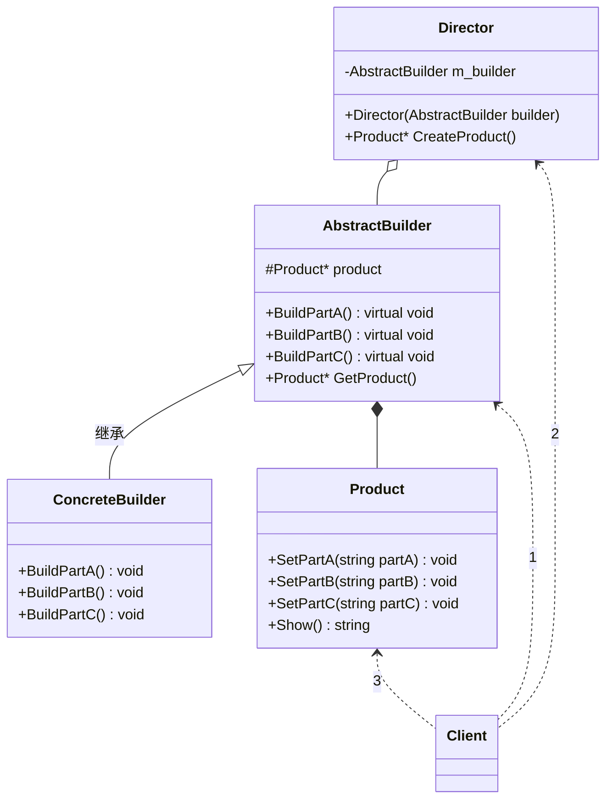

# 建造者模式（Builder）
**定义** ：将构建与表现分离，复杂的对象分解为多个简单的对象，然后一步一步构建成最终的复杂模块。相同的构建过程下不同的变现，各子模块的选择更具灵活性。

## 模式结构

* 抽象建造者（AbstractBuilder）：包含创建产品各个子部件的接口
* 具体建造者（ConcreteBuilder）：实现创建产品各子部件接口
* 指挥官（Director）：调用建造者对象中部件构造与装配方法组织如何将各简单的子部件组合成复杂的产品，不涉及具体产品信息
* 产品（Product）：各简单子部件组合成的复杂产品，有具体创建者创建各个零部件。

## 优点：

1. 封装性好，构建和表示分离。
2. 扩展性好，各个具体的建造者相互独立（高灵活性），有利于系统的解耦。
3. 客户端不必知道产品内部组成的细节，建造者可以对创建过程逐步细化，而不对其它模块产生任何影响，便于控制细节风险。

### 缺点：

1. 产品的组成部分必须相同（CreateProduct逻辑部分），这限制了其使用范围。
2. 如果产品的内部变化复杂，如果产品内部发生变化，则建造者也要同步修改，后期维护成本较大。

#### 比较建造者与工厂模式：

1. 建造者模式注重零部件的组装过程，而工厂方法模式更注重零部件的创建过程，但两者可以结合使用。
2. 建造者模式注重于对象组合，即不同的小对象组成一个整体的复杂大对象，而抽象工厂模式针对于接口编程，只是对外提供创建对象的工厂接口，不负责对象之后的处理。

## 总结：

建造者模式是把复杂对象的创建和部件的创建分别开来，分别用Builder类和Director类来表示。用Director构建最后的复杂对象，而在上面Builder接口中封装的是如何创建一个个部件（复杂对象是由这些部件组成的），也就是说，Director负责如何将部件最后组装成产品。这样建造者模式就让设计和实现解耦了。
