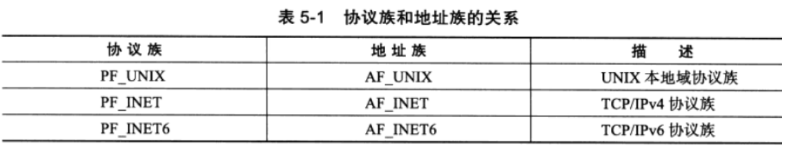
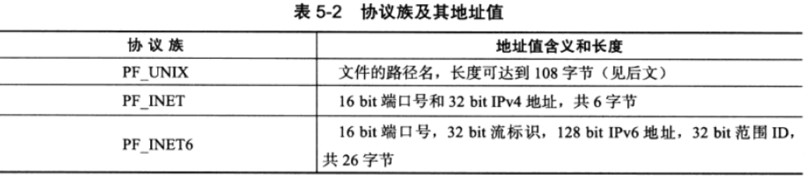
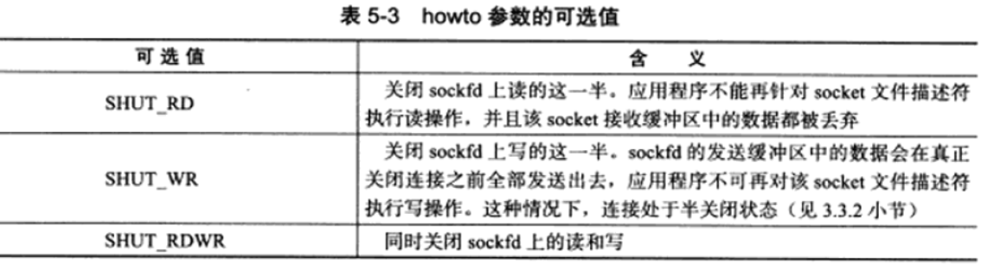
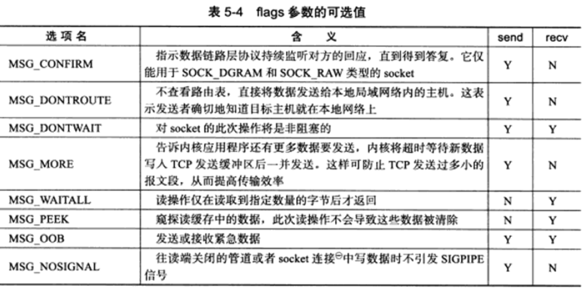
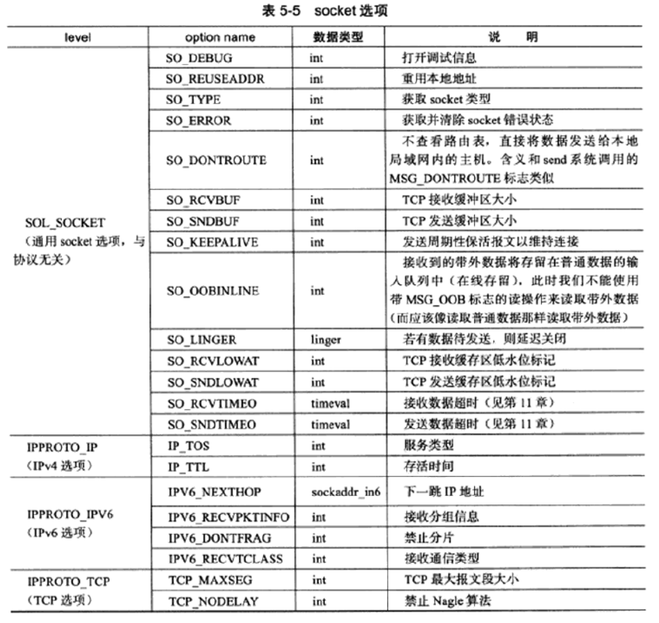
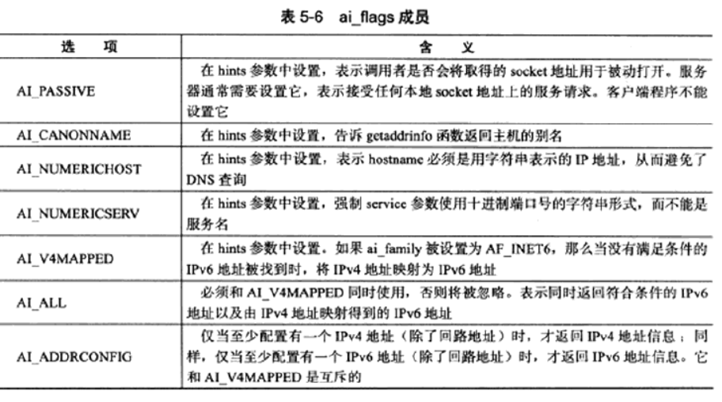
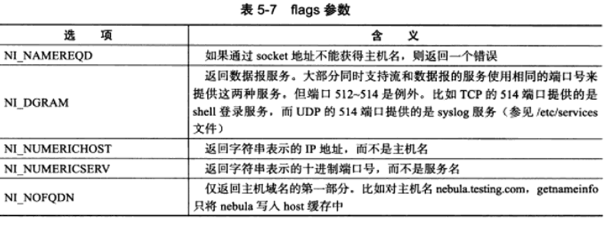
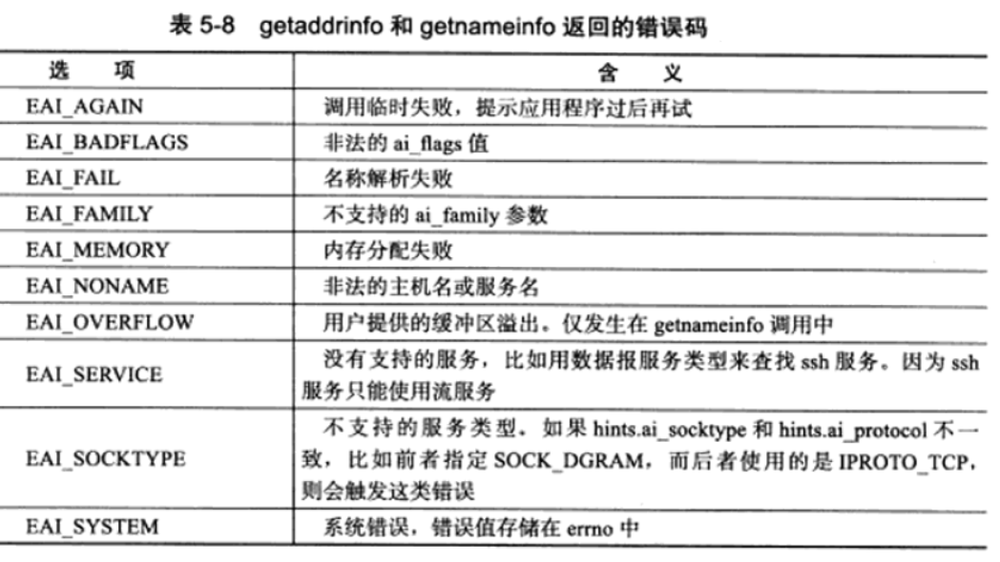

# 第 5 章 Linux网络编程基础API

知识要点：

* socket 地址 API
* socket 基础 API
* 网络信息 API

## 1、socket 地址API

### 主机字节序和网络字节序

CPU （32位）的累加器一次至少可以装载 4 字节，即一个整数。该 4 字节在内存中的排列顺序将影响其被累加器装载成的整数的值 => 字节序问题。

**大端字节序（网络字节序）：** 数据的高字节数据存储在内存的低地址处。当数据在使用不同字节序的机器间传递数据时，对于数据的解析将会出错，因此，规定在发送端总是将数据转化为大端字节序数据后再进行发送，接收端知道数据总是大端字节序，则根据自身本机采用的字节序决定是否需要转化，确定了数据收发的正确性。

**小端字节序（主机字节序）：** 数据的低字节数据存储在内存的低地址处。一般的 PC 都是采用小端字节序，因此又称主机字节序。


### 通用 socket 地址

``` C++
#include <bits/socket.h>
struct sockaddr
{
    //地址族变量 与协议族类型对应
    sa_family_t sa_family;
    //存放 socket 地址值
    //不同的协议的含义和长度不同，后续针对具体协议专用的结构体
    char sa_data[14];
};
```

常见协议族（protocol family，也称 domin）与对应地址族如下图，两者具有相同的值，可以混用。



`sa_data` 成员存放的 `socket 地址值` 对应关系



14 字节的 `sa_data` 成员无法容纳多数协议族的地址值，提出新的通用 ` socket` 地址结构体

``` C++
#include <bits/socket.h>
struct sockaddr_storage
{
    sa_family_t sa_family;
    unsigned long int __ss_align;
    char __ss_padding[128 - sizeof(__ss_align)];
};
///提供更大空间存储地址值，且内存对齐（__ss_align作用）
```


### 专用 socket 地址

Linux 为各协议族提供专门的 socket 地址结构体，方便设置与获取 IP 地址和端口。

**Unix：**

```C++
#include <sys/un.h>
struct sockaddr_un
{
    sa_family_t sa_family;//地址族：AF_UNIX
    char sun_path[108];//文件路径名
};
```


**IPV4：**

```C++
struct in_addr
{
    u_int32_t s_addr;//IPV4地址，网络字节序表示
};

struct sockaddr_in
{
    sa_family_t sin_family;//地址族：AF_INET
    u_int16_t sin_port;//端口号，网络字节序表示
    struct in_addr sin_addr;//IPV4地址结构体
};
```


**IPV6：**

```C++
struct in6_addr
{
    unsigned char sa_addr[16];//IPV6地址，网络字节序表示
};

struct sockaddr_in
{
    sa_family_t sin6_family;//地址族：AF_INET6
    u_int16_t sin6_port;//端口号，网络字节序表示
    u_int32_t sin6_flowinfo;//流消息，设置为0
    struct in6_addr sin6_addr;//IPV6地址结构体
    u_int32_t sin6_scope_id;//scope ID
};
```

**注意：** 所有专用 socket 地址在使用 socket 编程接口时都需要转换成通用 socket 地址（sockaddr 类型）。


### IP 地址转换

**IPV4：**

``` c++
#include <arpa/inet.h>
//将用点分十进制字符串表示的 IPV4 地址转换成网络字节序整数表示的 IPV4 地址,
//失败返回 INADDR_NONE
in_addr_t inet_addr(const char* strptr);
//与 inet_addr 功能一致，将结果存入 inp 指向的结构体中
//失败返回 0，成功返回 1
int inet_aton(const char* cp, struct in_addr* inp);
//将网络字节序整数表示的 IPV4 地址转化为用点分十进制表示的 IPV4 地址
//内部使用静态变量存储转化结果，返回值指向该静态内存，不可重入
//失败返回 0，成功返回 1
char* inet_ntoa(struct in_addr in);
```

**IPV4 与 IPV6 同时适用：**

``` C++
#include <arpa/inet.h>
//10进制点分字符串的IPV4地址或16进制IPV6地址转换成网络字节序整数的IP地址，并存入dst内存
//af：对应的协议族 AF_INET 或 AF_INET6
//失败返回 0，成功返回 1
int inet_pton(int af, const char* src, void* dst);

//与inet_pton函数相反，socklen_t 指定目标存储单元的大小见后续宏
//成功返回目标存储单元地址，失败返回NULL并设置errno
const char* inet_ntop(int af, const char* src, char* dst, socklen_t cnt);

#include <netinet/in.h>
#define INET_ADDRSTRLEN 16
#define INET6_ADDRSTRLEN 46

```


## 2、创建 socket

``` C+
#include <sys/types.h>
#include <sys/socket.h>
/**
	domin:底层协议族 PF_INET/PF_INET6/PF_UNIX
	type:服务类型 SOCK_STREAM/SOCK_DGRAM
	protocol: 具体协议，唯一值，一般设为0表示使用默认协议
	成功返回 socket 文件描述符，失败返回 -1 并置 errno
*/
int socket(int domin, int type, int protocol);
```

**拓展：** type值可以和 `SOCK_NONBLOCK 及 SOCK_CLOEXEC` 标志相与，表示新创建的 socket 为非阻塞，以及 fork 调用创建子进程时在子进程中关闭该socket


## 3、命名 socket

```C++
#include <sys/types.h>
#include <sys/socket.h>
/**
	fd: 需要命名的socket的文件描述符
	myaddr: 分配的 socket 地址
	addrlen: sizeof(myaddr)
	成功返回0，失败返回 -1 置 errno
	EACCESS: 被绑定的地址是受保护的地址，仅超级用户能够访问，如：绑定到知名服务端口(0~1023)
	EADDRINUSE: 被绑定的地址正在使用，如：处于TIME_WAIT状态的 socket 地址
*/
int bind(int fd, const struct sockaddr* myaddr, socklen_t addrlen);
```


## 4、监听 socket

socket 被命名后，需要调用系统调用来创建一个监听队列存放待处理的客户连接。

```C++
#include <sys/socket.h>
/**
	sockfd: 被监听的 socket
	backlog: 监听队列中处于ESTABLISED状态的最大值，当超过时服务器不再受理新的客户连接，客户	端收到 ECONNREFUSED 错误信息(但实际值往往可能为backlog+1)
	成功返回0，失败返回 -1 置 errno
*/
int listen(int sockfd, int backlog);
```


## 5、接受连接

```C++
#include <sys/types.h>
#include <sys/socket.h>
/**
	sockfd: listen系统调用的监听socket
	addr: 获取接受连接的远程socket地址
	addrlen: socket长度
	成功返回0，失败返回 -1 置 errno
*/
int accept(int sockfd,struct sockaddr* addr, socklen_t* addrlen);

//accept只是从监听队列中取出连接，而不论连接处于何种状态(如CLOSE_WAIT),更不关心网络状况的变化
```


## 6、发起连接

客户端主动的发起连接，服务端被动的接受连接。

```C++
#include <sys/types.h>
#include <sys/socket.h>
/**
	sockfd: 创建socket返回的文件描述符，通过读取该sockfd来与服务端进行通信
	serv_addr: 需要连接的服务端socket地址
	addrlen: socket地址长度
	成功返回0，失败返回 -1 置 errno
*/
int connect(int sockfd, const struct sockaddr* serv_addr, socklen_t* addrlen);

ECONNREFUSED: 目标端口不存在，连接被拒绝
ETIMEDOUT:连接超时
```


## 7、关闭连接

```C++
#include <unistd.h>
/**
	并非是立刻关闭一个连接，而是将fd的引用计数减1，当fd的引用计数为0才真正关闭连接
	多进程时，一次fork默认会将父进程打开的socket的引用加1，必须在父子进程中都对该socket执行	close调用才能将连接关闭。
*/
int close(int fd);
```


**立即终止连接！**

```C++
#include <sys/socket.h>
/**
	成功返回0，失败返回 -1 置 errno
*/
int shutdown(int sockfd, int howto);
```




## 8、数据读写

### TCP 数据读写

```C++
#include <sys/types.h>
#include <sys/socket.h>
/**
	sockfd: 从sockfd读取、往sockfd写入
	buf: 读/写缓冲区
	len: 缓冲区长度
	flags: 额外控制的标志
*/

//成功返回实际读取到的长度，可能小于期望值len则可以多次调用读取完整
//返回0时，以为通信对方已经关闭连接
//失败返回 -1 置 errno
ssize_t recv(int sockfd, void* buf, size_t len, int flags);
//成功返回实际写入的长度，失败返回 -1 置 errno
ssize_t send(int sockfd, const void* buf, size_t len, int flags);
```



send 与 recv 设置的flags是一次性的，可以通过 setsockopt 系统调用永久性的修改 socket 某些属性。


### UDP 数据读写

```C++
#include <sys/types.h>
#include <sys/socket.h>
/**
	UDP协议不是面向连接的，
	接收时都要记录发送方的地址和端口
	发送时需要指明发送给哪个地址和端口
	返回值与send/recv一致，TCP使用该接口时可以把最后两个参数置为 NULL
*/
ssize_t recvfrom(int sockfd, void* buf, size_t len, int flags, struct sockaddr_in* src_addr, socklen_t* addrlen);
ssize_t sendto(int sockfd, const void* buf, size_t len, int flags, struct sockaddr_in* dest_addr, socklen_t* addrlen);
```


### 通用数据读写函数

socket 编程接口提供即支持 TCP 又支持 UDP 的读写系统调用。

```C++
#include <sys/socket.h>

struct iovec
{
    void* iov_base;//内存起始地址
    size_t iov_len;//内存的长度
};

struct msghdr
{
    //socket地址，指向 socket 地址结构变量，指定通信对方socket地址，对于TCP无用置为NULL
    void* msg_name;
    //socket地址的长度
    socklen_t msg_namelen;
    //分散的内存块
    struct iovec* msg_iov;
    //分散内存块的数量
    int msg_iovlen;
    //指向辅助数据的起始位置
    void* msg_control;
    //辅助数据的大小
    socklen_t msg_controllen;
    //复制函数中flags参数，在调用过程中更新
    int msg_flags;
};

//返回值与send/recv一致
ssize_t recvmsg(int sockfd, struct msghdr* msg, int flags);
ssize_t sendmsg(int sockfd, struct msghdr* msg, int flags);
```


**分散读：** 对于recvmsg读取的数据将存放在msg_iovlen块分散的内存中，内存的地址及长度由msg_iov指向的数组决定

**集中写：** 对于sendmsg而言，msg_iovlen块分散内存中的数据将一并发送


## 9、带外数据

Linux 内核检测到 TCP 紧急标志时，将会通过 **IO 复用产生的异常事件和 SIGURG 信号** 来通知应用程序有带外数据需要接收。

```C++
#include <sys/socket.h>
/**
	判断 sockfd 下一个被读取到的数据是否是带外数据
	是：返回 1 ，否：返回0
*/
int sockatmark(int sockfd);
```


## 10、获取地址信息函数

``` C++
#include <sys/socket.h>
/**
	获取本端连接的socket地址信息存入address,长度存入address_len
	若实际socket地址长度比address所指向的内存区大，则地址将被截断
	成功返回0，失败返回 -1 置 errno
*/
int getsockname(int sockfd, struct sockaddr* address, socklen_t* address_len);
/**
	获取通信连接另一端的socket地址
	参数和返回值含义与getsockname同
*/
int getpeername(int sockfd, struct sockaddr* address, socklen_t* address_len);
```


## 11、socket 选项

fcntl 系统调用专门用来控制文件描述符属性，socket 编程接口也提供了设置 socket 文件描述符属性的方法：

```C++
#include <sys/socket.h>
int getsockopt(int sockfd,//指定被操作的 目标socket
               int level,//指定操作哪个协议的属性
               int option_name,//选项的名字
               void* option_value,//被操作选项的值
               socklen_t* restrict option_len//被操作选项的长度         
              );

int setsockopt(int sockfd, int level, int option_name, const
               void* option_value, socklen_t* option_len);

```



**注意：** 对于服务端而言， listen 之后，accept 从监听队列中返回的连接至少完成了 TCP 三次握手的前两阶段即进入 SYN_RECVD 状态，通信双方的同步报文段都已经发送给对方，而有些属性如：TCP最大报文段，则只能由同步报文段来发送，所以需要在 listen 之前设置属性；对于客户端则需要在 connect 之前设置属性。

对 listen 之前设置的属性，accept 返回的连接将自动继承：SO_DEBUG、SO_DONTROUTE、SO_ KEEPALIVE、SO_ LINGER、 SO_ _OOBINLINE、SO_ _RCVBUF、SO_RCVLOWAT、SO_ _SNDBUF、SO_ SNDLOWAT、TCP_ MAXSEG 和 TCP_ NODELAY


## 11、网络信息 API

### gethostbyname 和 gethostbyaddr

gethostbyname 通过主机名称获取主机的完整信息，函数通常先在本地的 `/etc/hosts` 配置文件中查找主机，如果没有找到再去访问 DNS 服务器。

gethostbyaddr 通过地址名获取主机的完整信息。

```C++
#include <netdb.h>

struct hostent
{
	char* h_name;//主机名
	char** h_aliases;//主机别名列表
	int h_addrtype;//地址族类型
	int h_length;//地址长度
	char** h_addr_list;//网络字节序列出的主机IP地址列表
};

/**
	name: 目标主机名称
*/
struct hostent* gethostbyname(const char* name);

/**
	name: 目标主机IP地址
	len: 指定IP地址的长度
	type: AF_INET/AF_INET6
*/
struct hostent* gethostbyaddr(const void* addr, size_t len, int type);
```


### getservbyname 和 getservbyport

通过服务名称获取某个服务的完整信息 及 通过端口获取某个服务的完整信息。

都是通过读取 `/etc/services` 文件获取服务的信息。

``` C++
#include <netdb.h>

struct servent
{
    char* s_name;//服务的名称
    char** s_aliases;//服务的别名列表
    int s_port;//服务的端口号
    char* s_proto;//服务类型，tcp或udp
};
/**
	name: 目标服务的名称
	proto: 服务类型，"tcp"表示获取数据流服务，“udp”表示获取数据报服务
*/
struct servent* getservbyname (const char* name, const char* proto);
/**
	name: 目标服务的端口
	proto: 服务类型，"tcp"表示获取数据流服务，“udp”表示获取数据报服务
*/
struct servent* getservbyport (int port, const char* proto);
```


### getaddrinfo

即能通过主机名获取IP地址(内部gethostbyname)，也能通过服务名获取端口号(内部getservbyname)

``` C++
#include <netdb.h>

struct addrinfo
{
    int ai_flags;//取表5-6中标志的按位或
    int ai_family;//地址族
    int ai_socktype;//服务类型，SOCK_STREAM/SOCK_DGRAM
    int ai_protocol;//指具体协议，与socket系统调用一致，一般设为0
    socklen_t ai_addrlen;//ai_addr的长度
    char* ai_canonname;//主机的别名
    struct sockaddr* ai_addr;//指向socket地址
    struct addrinfo* ai_next;//指向下一个sockinfo结构的对象
};

int getaddrinfo(
    			//即可接收主机名又可字符串表示的IP地址(IPV4: 点分十进制，IPV6: 十六进制)
    			const char* hostname,
    			//即可接收服务名也可接收字符串表示的十进制端口号
                const char* service, 
    			//精确控制输出，NULL表示反馈任何可用的结果；
    			//使用时可以设置ai_flags、ai_family、ai_socktype、ai_protocol四个字段，其余必须置为NULL
                const struct addrinfo* hints,
    			//指向一个反馈结果的链表
                struct addrinfo** result);

//getaddrinfo 将隐式的分配堆内存(result),需要配对的函数释放内存
void freeaddrinfo(struct addrinfo* res);
```




### getnameinfo

通过socket地址同时获取字符串表示的主机名(内部gethostbyaddr)和服务名(内部getservbyport)

```C++
#include <netdb.h>
int getnameinfo(const struct sockaddr* sockaddr,//传入的socket地址
                socklen_t addrlen,//地址长度
                char* host,//返回的主机名
              	socklen_t hostlen,//长度
                char* serv, //返回的服务名
                socklen_t servlen,//长度
                int flags//精确控制行为
               );
```




**getaddrinfo 和 getnameinfo 函数成功返回 0，失败返回错误码 **



```C++
#include <netdb.h>
//将数值错误码转换成易读字符串
const char* gai_strerror(int error);
```


|     名称      |                             作用                             | 特点                                     |
| :-----------: | :----------------------------------------------------------: | ---------------------------------------- |
| gethostbyname |                通过主机名称获取主机的完整信息                | 不可重入(xxx_r版本可以)                  |
| gethostbyaddr |                通过地址名称获取主机的完整信息                | 不可重入(xxx_r版本可以)                  |
| getservbyname |              通过服务名称获取某个服务的完整信息              | 不可重入(xxx_r版本可以)                  |
| getservbyport |                通过端口获取某个服务的完整信息                | 不可重入(xxx_r版本可以)                  |
|  getaddrinfo  | 即能通过主机名获取IP地址(内部gethostbyname)，也能通过服务名获取端口号(内部getservbyname) | 是否可重入取决于调用的内部函数是否可重入 |
|  getnameinfo  | 通过socket地址同时获取字符串表示的主机名(内部gethostbyaddr)和服务名(内部getservbyport) | 是否可重入取决于调用的内部函数是否可重入 |