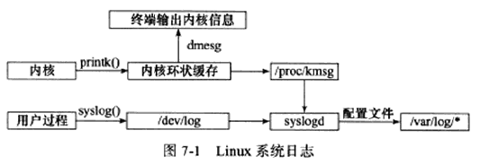

# 第 7 章 Linux服务器程序规范

守护进程：以后台进程形势运行，没有控制终端，从而不会意外收到用户输入；守护进程的父进程通常为 init 进程(PID = 1)


## 1、日志

Linux 提供 syslogd 守护进程以及升级版 rsyslogd 守护进程来处理系统日志。rsyslogd 守护进程既能接受用户进程输出的日志，又能接收内核日志。



**用户过程：** 用户进程调用 `syslog()` 函数将系统日志生成到一UNIX本地域socket类型(AF_UNIX)的文件 `/dev/log ` 中， `rsyslogd` 监听该文件获取用户进程的输出日志。

**内核：** 使用的是 `rklogd守护进程` 管理，不过`rsyslogd` 可以利用额外模块实现相同功能。调用 `printk` 等函数将日志打印到内核环状缓存，该缓存直接映射到`/proc/kmsg` 文件，`rsyslogd` 通过读取该文件获取内核日志。


### syslog 函数

应用程序使用 `syslog`   函数与 `rsyslogd` 守护进程通信，采用可变参数(第二个参数和第三参数)来结构化输出。

```C++
#include <syslog.h>
/**
priority: 设施值与日志级别的按位或，设施值默认为LOG_USER
    #define LOG_EMERG 		0 //系统不可用
    #define LOG_ALERT 		1 //报警，需要立即采取动作
    #define LOG_CRIT  		2 //非常严重的情况
    #define LOG_ERR   		3 //错误
    #define LOG_WARNING 	4//警告
    #define LOG_NOTICE 		5//通知
    #define LOG_INFO		6//信息
    #define LOG_DEBUG		7//调试
*/
void syslog(int priority, const char* message, ...);

/**
	改变syslog函数默认输出方式，
	ident：字符串会被添加到日志信息的日期和时间之后
	logopt：对后续syslog调用的行为进行配置，取以下值按位或
		#define  LOGPID 0x01 在日志消息中包含程序PID
 		#define  LOG_CONS 0x02 如果消息不能记录到日志文件，则打印至终端
		#define  LOG_ODELAY 0x04 延迟打开日志功能直到第一次调用syslog
 		#define  LOG_NDELAY 0x08 不延迟打开日志功能
 	facility：改变syslog默认设施值
*/
void openlog(const char* ident, int logopt, int facility);

/**
	设置日志掩码，使日志级别大于日志掩码的日志信息被系统忽略
	成功返回调用进程之前的日志掩码值
*/
int setlogmask(int maskpri);

/**
	关闭日志功能
*/
void closelog();
```


## 2、用户信息


## 3、进程间关系

### 进程组

* Linux 下每个进程都隶属于一个进程组，因此除了PID信息外，还有进程组ID（PGID）
* 每个进程组都有一个首领进程，其PID = PGID，进程组一直存在，直到所有进程都退出或加入其他进程组


```C++
#include <unistd.h>

/**
	获取指定进程的PGID
	成功返回进程pid所属进程组的PGID，失败-1置errno
*/
pid_t getpgid(pid_t pid);

/**
	设置PID为pid的进程的PGID为pgid，
	if(pid == pgid) 则该进程将设置为首领进程
	if(pid == 0) 表示设置当前进程的PGID为pgid
	if(pgid == 0) 则使用pid作为目标PGID
	成功0，失败-1置errno
	注意：一个进程只能设置自己或子进程的PGID，且当子进程调用exec系列函数后，不能再在父进程中设置其PGID
*/
int setpgid(pid_t pid, pid_t pgid);
```


### 会话

有关联的进程组将形成一个会话。

```C++
#include <unistd.h>
/**
	创建会话
	不能由进程组的首领进程调用，否则错误
	非首领进程调用后将新建会话，且
		1、调用进程将成为会话的首领，该进程为新会话的唯一成员
		2、新建一个进程组，PGID就是调用该函数的进程PID，进程组的首领为该进程
		3、调用进程将甩开终端
	成功返回新的进程组PGID，失败-1置errno
*/
pid_t setsid(void);

/**
	Linux未提供所谓会话ID(SID)的概念，Linux系统认为等于会话首领所在的进程组PGID
*/
pid_t getsid(pid_t pid);
```

```C++
ps -o pid,ppid,pgid,sid,comm | less //ps 命令查看进程关系
```


## 4、系统资源限制

Linux 运行的程序将会受如：物理设备限制(CPU数量、内存数量等)、系统策略限制(CPU时间等)以及具体实现(文件名的最大长度)等的资源限制。

```C++
#include <sys/resource.h>

struct rlimit
{
    //rlim_t 整数类型
    //软限制，建议性的最好不要超过，否则系统可能发送信号终止进程运行
    rlim_t rlim_cur;
    //硬限制，是软限制的上限，以root身份才能增加，普通程序只能减小
    rlim_t rlim_max;
};

int getrlimit(int resource, struct rlimit* rlim);
int setrlimit(int resource, const struct rlimit* rlim);
```


## 5、改变工作目录和根目录

```C++
#include <unistd.h>

/**
	获取当前工作目录
	buf: 存储进程当前工作目录的绝对路径名
		if(strlen(buf) + 1 > size) 返回NULL，置errno为ERANGE
		if(NULL = buf && size > 0) 内部调用malloc分配内存存储当前工作目录
	成功返回指向buf缓存区或内部动态分配内存的指针
	失败返回NULL置errno
*/
char* getcwd(char* buf, size_t size);

/**
	改变进程工作目录
	path:指定要切换的目标目录
	成功0，失败-1置errno
*/
int chdir(const char* path);

/**
	改变进程根目录
	成功0，失败-1置errno
	并不改变进程当前工作目录，调用之后仍要使用chdir("/")切换到新的根目录
	无法访问类似/dev文件，因为那些不处于新的根目录下，但原来已经打开的文件描述符任然有效
*/
int chroot(const char* path);
```


## 6、服务器程序后台化

在代码中让以进程以守护进程的方式运行。

```C++
#include <unistd.h>
/**
	nochdir: 用于指定是否改变工作目录，0则将工作目录设置为"/"根目录，否则使用当前工作目录
	noclose: 0：标准输入、标准输出和标准错误输出将重定向到/dev/null文件，否则使用原来的设备
	成功0，失败-1置errno
*/
int daemon(int nochdir, int noclose);
```

