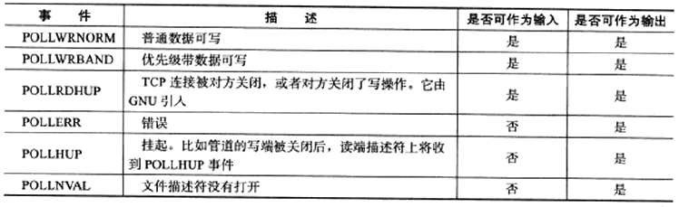

# 第 9 章 I/O 复用

 I/O 复用能使程序同时监听多个文件描述符，大大提高程序性能。使用 I/O 复用有如下常用场景：

* 客户端要同时处理多个 socket
* 客户端要同时处理用户输入和网络连接，如聊天程序
* TCP 服务器要同时处理监听 socket 和连接 socket，这是最常见的场景
* 服务器要同时处理 TCP 请求和 UDP请求，如回射服务器
* 服务器要监听多个端口处理多种服务

I/O 复用虽然能监听多个文件描述符，但其本身还是阻塞的，且如果当多个文件描述符同时就绪，若没有采取多进程或多线程等编程手段，则程序只能按照顺序依次处理每个文件描述符。Linux 下实现 I/O 复用的系统调用有 select/poll/epoll。


# 1、select 系统调用

在一段时间内，监听用户感兴趣的文件描述符上的可读、可写和异常事件。

```C++
#include <sys/select.h>

/**
	fd_set结构体仅包含一个整形数组，每个元素的每一位标记一个文件描述符，
	fd_set容纳文件描述符数量由 FD_SETSIZE 指定(通常1024)，则指定了select能处理的文件描述符总量。
	位操作过于繁琐，使用以下宏来访问fd_set结构体中的位
*/
FD_ZERO(fd_set* fd_set);//清除fd_set所有位
FD_SET(int fd, fd_set* fd_set);//设置fd_set的位fd
FD_CLR(int fd, fd_set* fd_set);//清除fd_set的位fd
int FD_ISSET(int fd, fd_set* fd_set);//判断fd_set的位fd是否被设置

struct timeval
{
    long tv_sec;//秒
    long tv_usec;//微秒
};
/**
描述：
	客户将感兴趣的文件描述符传入对应的文件描述符集合(readfds/writefds/exceptfds),
	select调用返回时，内核将修改对应的集合以通知客户哪些文件描述符已就绪
	timeval结构体指针，在成功返回时会告诉应用程序select等待了多久
返回值：
	成功返回就绪(可读、可写和异常)文件描述符的总数
	0：超时时间内没有任何文件描述符就绪
	-1并置errno:失败或者在select等待期间收到信号(errno置EINTR)
*/
int select(int nfds,//被监听文件描述符的总数，通常为所有文件描述符最大值加1，因为是从0开始计数 
           fd_set* readfds,//指向可读事件文件描述符集合
           fd_set* writefds,//指向可写事件文件描述符集合
           fd_set* exceptfds,//指向异常事件文件描述符集合
           struct timeval* timeout//超时时间设置 0：立刻返回, NULL: 阻塞直到某个文件描述符就绪
          );
```


### 文件描述符就绪条件

对于select使用，需要知道文件描述符哪些情况被认为可读、可写或出现异常。网络编程中，

**socket 可读：**

* socket 内核的接收缓存区中字节数大于其低水位标记 SO_RCVLOWAT，此时可以无阻塞的读该 socket
* socket 通信对方关闭连接，则对该 socket 的读操作返回0
* socket 上有未处理的错误，可以使用 getsockopt 来读取和清除该错误。

**socket 可写：**

* socket 内核的发送缓存区中字节数大于或等于其低水位标记 SO_SNDLOWAT，此时可以无阻塞的写该 socket
* 对写操作被关闭的 socket 执行写操作将被触发 SIGPIPE 信号
* socket 使用非阻塞 connect 成功或失败(超时)之后
* socket 上有未处理的错误，可以使用 getsockopt 来读取和清除该错误。

**socket 处理异常：**

* socket 接收到带外数据，对于异常事件，采用带 MSG_OOB 标志的 recv 函数读取带外数据


## 2、poll 系统调用

与 select 类似，在指定时间内轮询一定数量的文件描述符，测试其中是否有就绪者。

```C++
#include <poll.h>

struct pollfd
{
    int fd;//文件描述符
    short events;//注册的事件，即告诉poll监听fd上的哪些事件，一系列事件的按位或
    short revents;//实际发生的事件，由内核填充
};

/**
描述：
	fds:结构体数组，指定感兴趣的文件描述符上发生的事件
	nfds:无符号长整型，指定被监听事件集合fds的大小,即最多监听多少事件
	timeout:超时值，毫秒为单位。
		-1: poll将阻塞直到某事件发生
		0:poll立即返回
返回值：
	与select一致
*/
int poll(struct pollfd* fds, nfds_t nfds, int timeout);
```





## 3、epoll 系统调用

Linux 中特有的 I/O 复用函数，与select和poll只使用单个函数不同，epoll使用一组函数来完成I/O复用任务。epoll 将用户关心的文件描述符上的事件放在内核中的事件表中，因此无需重复的传入文件描述符集和事件集，但epoll需要使用一个额外的文件描述符用来标识内核中的这个事件表。

```C++
#include <sys/epoll.h>
/**
描述:
	size:给内核的一个提示，告诉它事件表需要多大
返回值:
	返回指向内核事件表的文件描述符，用作后续epoll函数调用的第一个参数
*/
int epoll_create(int size);


typedef union epoll_data
{
    void* ptr;//用户数据
    int fd;//该事件所从属的文件描述符
    uint32_t u32;
    uint64_t u64;
}epoll_data_t;

struct epoll_event
{
    __uint32_t events;//epoll事件
    epoll_data_t data;//用户数据
};

/**
描述:
	epfd:指向内核事件表的文件描述符
	fd:需要操作的文件描述符
	op:指定操作类型
		EPOLL_CRL_ADD:往事件表中注册fd上的事件
		EPOLL_CRL_MOD:修改fd上的注册事件
		EPOLL_CRL_DEL:删除fd上的注册事件
	event:指定事件，支持的事件和poll基本相同，在对应宏前面加"E"，不过有额外事件(EPOLLET/EPOLLONESHOT)
返回：
	成功 0，失败 -1 置errno
*/
int epoll_ctl(int epfd, int op, int fd, struct epoll_event* event);

/**
描述:
	在一段超时时间内等待一组文件描述符上的事件
	timeout:与poll一致
	maxevents：最多监听多少事件
	events：当epoll_wait监听到事件，从内核事件表中复制所有就绪的事件到该结构体数组
	epfd：内核事件表对应的文件描述符
返回：
	成功返回就绪的文件描述符个数，失败返回 -1 置errno
*/
int epoll_wait(int epfd, struct epoll_event* events, int maxevents, int timeout);
```


### LT 和 ET 模式

**LT (Level Trigger，电平触发)：** epoll_wait 检测到有事件发生将通知应用程序，应用程序可以不立刻该事件，则下擦调用 epoll_wait 还会向应用程序通告此事件，直到事件被处理，相当于效率较高的poll。

**ET (Edge Trigger，边沿触发)：** epoll_wait 检测到有事件通知应用程序，应用程序必须立即处理该事件，因为后续 epoll_wait 将不再向应用程序通知这一事件，因此，**处于 ET 模式的文件描述符需要是非阻塞的**，不然没有后续事件的到来就会一直处于阻塞状态（饥渴状态）。epoll 的高效工作模式。

实现：往 epoll 内核事件表中注册一个文件描述符上的 EPOLLET 事件，则epoll将以ET模式来操作该文件描述符。

体现：如在读数据时，LT 模式可以不用一次将接受缓存区的数据都读完可以分几次，因为只要有数据就一直处于事件就绪状态；而 ET 模式，则需要在一次事件到来时将这些数据都读出来，因为没有反复的事件告诉应用程序缓存区还有数据。


### EPOLLONESHOT 事件

**引入背景：** 即使使用了 ET 模式，一个 socket 上的某个事件还是可能被触发多次，尤其是在并发程序中。如：一个线程或进程在读取完某 socket 上的数据后开始对数据进行处理，处理的过程中，该socket又有新的数据可读，则 EPOLLIN 再次被触发，将唤醒一个新的线程或进程来进行处理，这个时候出现了两个不同的线程对同一个 socket 进行操作，而我们期望的是在任意时刻一个 socket 连接只能被一个线程处理，即引出了 epoll 的 EPOLLONESHOT  事件。

**效果：** 注册了 EPOLLONESHOT 事件的文件描述符，操作系统最多触发其上注册的一个可读、可写或者异常事件，且只触发一次；这样当一个线程在处理某个 socket 时，其他线程是不可能对该 socket 进行操作的，相对应的，该线程在处理完客户请求后，需要 epoll_ctl 重置该文件描述符上的 EPOLLONESHOT 事件，以确保该 socket 有事件被触发能让其他线程来处理。

**结论：** 尽管一个 socket 在不同时间可能被不同的线程处理，但同一时刻肯定只有一个线程为它服务，保证了连接的完整性，从而避免了很多可能的竞态条件。


## 4、三组 I/O 复用函数的比较

select、poll 和 epoll 都能同时监听多个文件描述符。等待 timeout 参数指定的的超时时间，直到一个或多个文件描述符上有事件发生时返回。返回值为事件就绪的文件描述符的数量，0表示没有事件发生。


### 事件集

**select：** 

* 参数类型 fd_set 没有将事件和文件描述符绑定，仅仅是一个文件描述符集，客户需要通过调用 3 个 fd_set 类型的参数来传入可读、可写和异常事件，使得 select 不能处理更多类型的事件
* 每次调用，内核都会修改 fd_set 集合，则下次调用需要重置这 3 个集合
* 每次调用返回整个用户注册的事件集合(包括就绪和未就绪的)，应用程序索引就绪文件描述符事件复杂度O(n)

**poll：**

* 文件描述符和事件都定义在 pollfd 类型，任何事件都统一处理。
* 内核每次都是修改 pollfd 结构体的 revents 成员，而注册事件 events 保持不变，因此无需每次调用都重置 pollfd  类型的事件集参数。
* 每次调用返回整个用户注册的事件集合(包括就绪和未就绪的)，应用程序索引就绪文件描述符事件复杂度O(n)

**epoll：**

* epoll_create 在内核中维护一个事件表，通过 epoll_ctl 来控制往其加入、修改和删除事件，epoll_wait 调用直接从内核事件表中取得用户注册的事件，而无须从用户空间读入这些事件。
* epoll_wait 调用的 events 参数仅用来返回就绪事件，所以应用程序索引就绪文件描述符的时间复杂度为O(1)


### 最大支持文件描述符数

**select：** 监听的最大文件描述符数量通常有限制

**poll：**nfds 参数指定最多监听多少文件描述符和事件，可达系统最大允许打开文件描述符数量65535

**epoll：** maxevents参数指定最多监听多少文件描述符和事件，可达系统最大允许打开文件描述符数量65535


### 工作模式

**select 和 poll**  为低效的 LT模式；**epoll** 可以工作在 ET 模式，且支持 EPOLLONESHOT 事件


### 具体实现

select 和 poll 都是采用的 轮询的方式，每次调用都要对整个注册文件描述符集合进行扫描，将其中就绪的文件描述符返回给应用程序，检测就绪事件算法的时间复杂度为O(n).

epoll_wait 采用回调的方式，内核检测到就绪的文件描述符时，将触发回调函数，回调函数将该文件描述符插入到内核就绪事件队列，内核在适当的时机将就绪事件队列中的内容拷贝到用户空间，无需对整个文件描述符集合进行轮询来检测哪些事件已经就绪，算法时间复杂度O(1)

但当活动连接较多时，epoll_wait 效率未必比 select 和 poll 高，因为回调函数过于频繁，因此，epoll_wait 适用于连接数量多但活动连接少的情况。


## 5、I/O 复用的高级应用一：非阻塞 connect

**实现：**

利用 connnct 中的 EINPROGRESS 返回值：使用的 socket 是非阻塞的，则调用 connect 后连接不会立马建立成功。可以调用 select 或 poll 来监听 socket 的可写事件判断是否建立连接。当可写事件就绪，通过调用 getsockopt 的 SOL_SOCKET 级别检查 SO_ERROR 选项。如果 SO_ERROR 为0则建立连接成功，否则失败。

```C++
//伪代码
int setnoblocking(int fd)
{
    int old_option = fcntl(fd, F_GETFL);
    int new_option = old_option | O_NONBLOCK;
    return old_option;
}

int sockfd = socket(...);
int oldopt = setnoblocking(sockfd);

int ret = connect(...);
if (ret) 连接成功，恢复 sockfd 属性并返回。
else if(EINPROGRESS != ret) 没有建立连接，且连接不是出于还在进行的状态，错误;

ret = select(sockfd + 1, NULL, &writefd, NULL, &TIME);
if(ret <= 0) 超时或出错，返回;
if(!FD_ISSET(sockfd, &writefd)) 没有写事件，则没有建立连接成功，返回;

if(getsockopt(sockfd, SOL_SOCKET, SO_ERROR, &error, &length) < 0)  错误，返回;
if(error != 0) 建立连接失败，返回;
建立连接成功;
恢复 sockfd 属性并返回。
```

**作用：** 非阻塞 connect 方式，可以同时发起多个连接并一起等待。


## 6、I/O 复用的高级应用二：聊天室程序

ssh 这样的登录服务通常要同时处理网络连接和用户输入。

**客户端：**

1. 从标准输入终端读入用户数据，并将用户数据发送至服务器。
2. 标准输出终端打印服务器发送给它的数据

使用 poll 同时监听客户输入及网络连接，并利用 splice 将用户输入内容直接定向到网络连接实现数据零拷贝发送。

**服务器：**

1. 接收客户数据，并把客户数据发送给每一个登陆到该服务器上的客户端。

使用 poll 同时管理监听 socket 和连接 socket。


## 7、I/O 复用的高级应用三：同时处理 TCP 和 UDP 服务

实际应用中，不少服务器程序能同时监听多个端口，如超级服务 inetd 和 android 的调试服务 adbd

从 bind 系统调用的参数看，一个 socket 只能与一个 socket 地址绑定，即一个 socket 只能用来监听一个端口。如需监听多个端口，则需创建多个 socket 绑定不同的端口，服务服务器程序就需要用到 I/O 复用来同时管理多个监听 socket。并且就算是同一个端口，TCP 和 UDP 使用的是不同的服务， TCP 需要创建流 socket，UDP 需要创建数据报 socket，然后将它们绑定到该端口。

