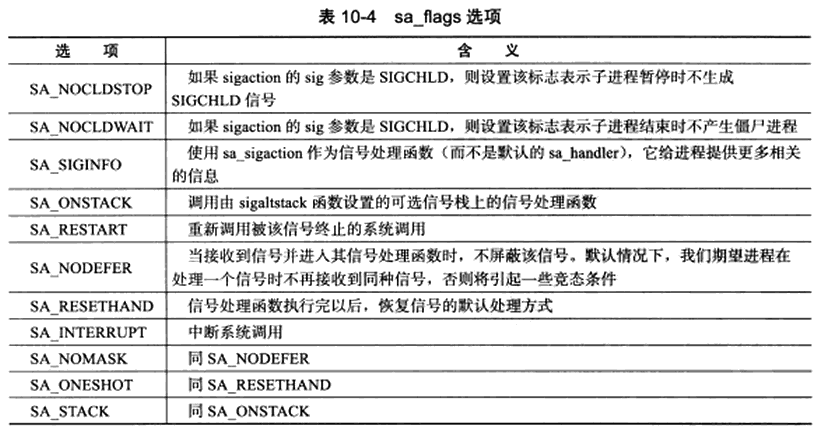

# 第 10 章 信号

**定义：** 

* 由用户、进程或系统发送给目标进程的信息；用以通知目标进程某个状态的改变或系统异常。

**产生的条件：**

* 对于前台进程，用户通过输入特殊的终端字符来发送信号。如：Ctrl + C 通常会给进程发送一个中断信号。
* 系统异常。如：非法的内存访问
* 系统状态变化。如：alarm 定时器到期将引起 SIGALRM 信号
* 运行 kill 命令或调用 kill 函数

服务器为了避免异常终止，必须处理或至少忽略一些常用的信号。

将对如何发送信号、处理信号和 Linux 支持的信号种类进行讨论。


# 1、Linux 信号概述

### 发送信号

Linux 下，一个进程给其他进程发送信号的 API 是 kill 函数

```C++
#include <sys/types.h>
#include <signal.h>

/**
描述：
	将信号sig发送给目标进程pid
	pid > 0, 信号发送给PID为pid的进程
	pid = 0, 信号发送给本进程组内的其他进程
	pid = -1,信号发送给除init进程外的所有进程，但发送者需要拥有对目标进程发送信号的权限 
	pid < -1,信号发送给组ID为-pid的进程组中的所有成员

返回：
	成功 0，失败 -1 置errno
		EINVAL：无效的信号
		EPERM：该进程没有权限发送信号给任何一个目标进程
		ESRCH：目标进程或进程组不存在
*/
int kill(pid_t pid, int sig);

/**
	Linux定义的信号值都大于0；取sig = 0,则kill函数将不发送任何信号，但可以用来检测目标进程或进程组是否存在，因为检查工作总是在发送之前执行，不过由于进程PID的回绕且不是原子操作，可能得到的不一定是期望的进程PID
*/
```


### 信号处理方式

目标进程接收到信号时，需要定义一个接收函数来处理：

```C++
#include <signal.h>
/**
	带有的一个整形参数是用来指示信号类型
	为避免竞态条件，信号处理函数需要是可重入的，所以内部严禁调用不安全的函数
*/
typedef void(*__sighandler_t)(int);

//系统提供的两种处理方式
#include <bitd/signum.h>
//忽略目标信号
#define SIG_IGN ((__sighandler_t) 1)
//按默认方式处理信号：结束进程(Term)、忽略信号(Ign)
//结束进程并生成核心转储文件(Core)、暂停进程(Stop)、继续进程(Cont)
#define SIG_DFL ((__sighandler_t) 0)

```

和网络编程关系紧密的信号：SIGHUP、SIGPIPE、SIGURG


### 中断系统调用

Linux 独有，程序在执行处于阻塞状态的系统调用时接收到信号，且该信号有设置信号处理函数，则默认情况下系统调用将被中断，errno 置为 EINTR。可以使用 sigaction 函数为信号设置 SA_RESTART 标志以自动重启被该信号中断的系统调用。

默认行为是暂停进程的信号（SIGSTOP、SIGTTIN），如果没有为其设置信号处理函数，也可以中断某些系统调用(如：connect、epoll_wait)


## 2、设置信号处理函数

```C++
#include <signal.h>

/**
描述：
	为信号sig设置处理函数 _handler
	sig:要捕获的信号类型
	_handler:用于指定sig的处理函数的函数指针
返回值：
	成功返回一函数指针，指向前一次调用该函数时传入的函数指针，或是信号sig对应的默认处理函数指针SIG_DEF
	失败返回 SIG_ERR 置errno
*/
_sighandler_t signal(int sig, _sighandler_t _handler);

struct sigaction
{
    ...
    union
    {
        _sighandler_t sa_hander;//信号处理函数
    }
    ...
    _sigset_t sa_mask;//用于在进程已有掩码的基础上增加掩码
    int sa_flags;//用于设置程序接收到信号时的行为
};
/**
	sig:指出要捕获信号的类型
	act:指定新的信号处理方式
	oact:输出信号先前的处理方式
	成功返回0，失败-1 置 errno
*/
int sigaction(int sig, const struct sigaction* act, struct sigaction* oact);
```

信号掩码：指定哪些信号不能发送给本进程。




## 3、信号集

Linux 用 sigset_t 来表示一组信号，实际为一个长整形数组，与文件描述符集 fd_set 类似，数组的每个元素的每个位表示一个信号。

```C++
#include <bits/sigset.h>
#define _SIGSET_NWORDS (1024 / (8*sizeof(unsigned long int)))

typedef struct
{
    unsigned long int __val[_SIGSET_NWORDS];
}__sigset_t;

//避免位操作的繁琐，提供以下函数：
#include <signal.h>
int sigemptyset(sigset_t* _set);//清空信号集
int sigfillset(sigset_t* _set);//在信号集中设置所有信号
int sigaddset(sigset_t* _set, int _signo);//将信号_signo添加至信号集
int sigdelset(sigset_t* _set, int _signo);//将信号_signo从信号集中删除
int sigismember(sigset_t* _set, int _signo);//检测_signo是否在信号集
```


### 设置或查看进程的信号掩码

```C++
#include <signal.h>

/**
	设置或查看进程的信号掩码
	_how：_set不为NULL时指定设置进程掩码的方式
	_set：指定新的信号掩码，为NULL时进程掩码不变
	_oset：输出原来的信号掩码
	成功 0， 失败 -1 置errno
*/
int sigprocmask(int _how, _const sigset_t* _set, sigset_t* _oset);
```


### 查看被挂起的信号

设置进程信号掩码后，被屏蔽的信号将不会发送给进程。但如果发送了一个被屏蔽的信号给进程，则操作系统会将该信号设置为进程的一个挂起信号，当我们取消对被挂起信号的屏蔽，该信号会立刻被进程接收到。

```C++
#include <signal.h>
/**
	获取进程当前被挂起的信号集
	_set:保存被挂起的信号集
	成功 0，失败 -1 置errno
*/
int sigpending(sigset_t* _set);
```

进程即使多次接收到同一被挂起的信号，sigpending 也只会反应一次，当使用 sigprocmask 重新使能该挂起的信号时，该信号的处理函数也只能被触发一次。

**总结：**

* 以进程、线程为单位来处理信号和信号掩码，需要清楚进程每个运行时刻的信号掩码及如何处理捕获到的信号。
* 不能设想新创建的进程、线程具有和父进程、主线程完全相同的信号特征，如：fork 产生的子进程将继承父进程的信号掩码，但挂起的信号集为空。


## 4、统一事件源

**背景：** 为避免一些竞态条件，信号在处理期间，系统不会再次调用它，即屏蔽；而信号处理函数和程序主循环是两条不同的执行路线，所以信号处理函数应该尽可能快的执行完毕。

**方案：** 将信号处理的主要逻辑放在主循环，当信号处理函数被触发，通过管道向主程序传递信号值，主程序根据收到的信号值执行目标信号的对应逻辑代码，主程序通过 I/O 复用监听管道的读端文件描述符上的可读事件。

将信号事件和其他 I/O 事件一样被处理，即统一事件源。

 

## 5、网络编程相关信号

### SIGHUP

**使用场景：** 挂起进程的控制终端时触发 SIGHUP。或者没有控制终端的网络后台程序，将利用 SIGHUP 信号来强制服务器重读配置文件，如： xinetd 超级服务程序收到 SIGHUP 信号后将循环读取配置文件检车其变化。

**信号值：** 1


### SIGPIPE

**触发条件：** 往读端关闭的管道或 socket 连接中写数据将触发 SIGPIPE 信号。

默认行为为结束进程，而我们不希望错误的写操作导致程序退出，引发 SIGPIPE 信号的写操作将置 errno为 EPIPE，因此需要处理或至少忽略该信号。

**处理：** 

* 使用 send 函数的 MSG_NOSIGNAL 标志禁止写操作触发 SIGPIPE 信号，则需要通过 send 返回的 errno 值判断管道或者 socket 连接的读端是否被关闭。
* 利用 I/O 复用检测管道和 socket 连接的读端是否被关闭。如：poll 当管道的读端关闭，写端文件描述符将触发 POLLHUP 事件；当 socket 连接对方被关闭，socket 上的POLLRDHUP 事件将被触发。


### SIGURG

**触发条件：** 内核通知应用程序有带外数据到达。(I/O复用及 SIGURG 信号)

**注意：** 使用SIGURG 信号前，需要设置 socket 的宿主进程或进程粗

`fcntl( connfd, F_SETOWN, getpid() );`


### 关于带外数据

1. TCP 模块是如何发送和接收带外数据的
2. 应用程序中使用带 MSG_OOB 标志的 send/recv 系统调用发送/接收带外数据
3. I/O 复用报告的异常事件和 SIGURG 信号通知机制
4. 检测到带外数据到达后，还需定位带外数据在数据流的位置，才能无误的读取带外数据，sockatmark 则判断一个 socket 下一个读取的数据是否是带外数据【