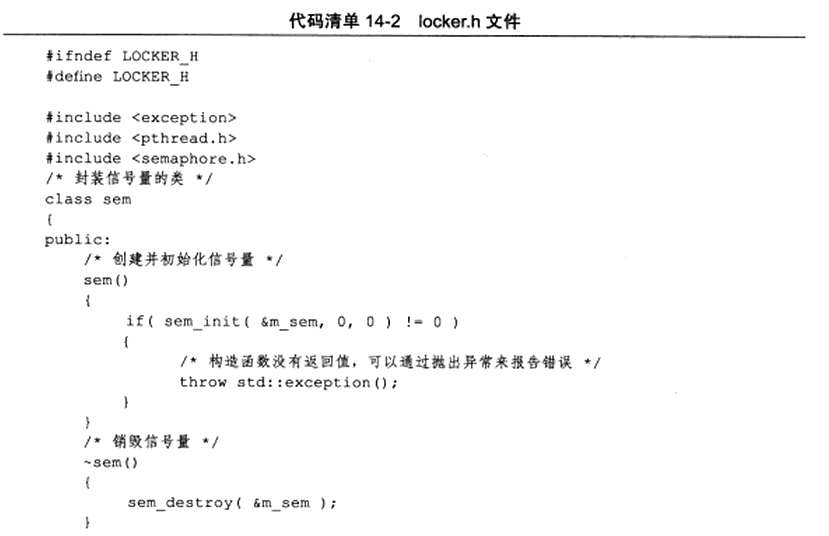
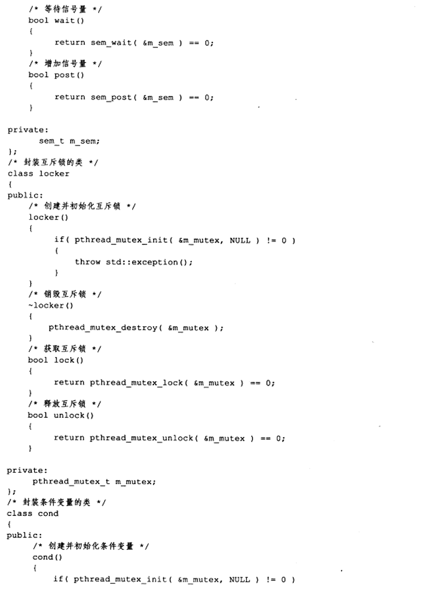
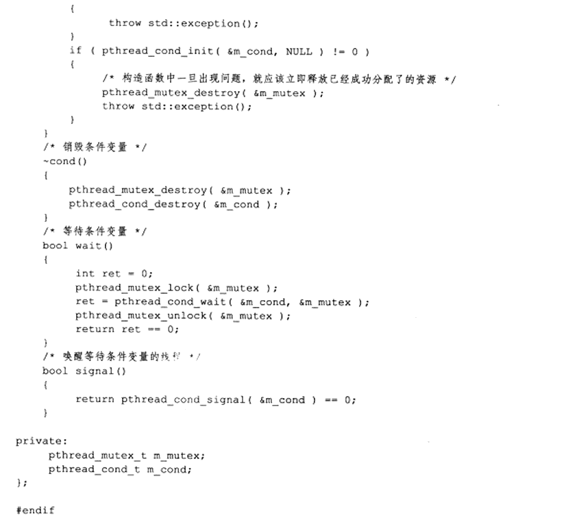

# 第 14 章 多线程编程

## 1、Linux 线程概述

**线程：** 程序中完成一个独立任务的完整执行序列，即一个可调度的实体。

根据运行环境和调度者的身份分为：内核线程和用户线程。

**内核线程：** 运行在内核空间，由内核调度，轻量级进程。

**用户线程：** 运行在用户空间，由线程库调度。

当一个内核线程获得 CPU 使用权时，它将加载并运行一个用户线程，即内核线程相当于用户线程运行的“容器”，可分为以下三种模式：

### 完全在用户空间实现

**描述：** 无需内核的支持，内核也不知道这些用户线程的存在，所以内核仍然将进程作为最小的调度单元，即该进程内所有执行的线程共享该进程的时间片，对外具有相同的优先级。使用线程库来进行管理，如线程的优先级、时间片等， longjmp 进行线程的切换，使看起来像是“并发”执行。

**优点：** 

1. 创建和调度都无需内核干预，速度快
2. 无需占用额外的内核资源，就算一个进程创建很多线程，也对系统性能没有明显影响

**缺点：**

1. 内核按最小调度单元来分配 CPU ，完全在用户空间实现的线程造成其对应的进程才是最小调度单元。因此，对于多处理器系统，多个线程无法运行在不同的 CPU 上
2. 线程的优先级只对同一个进程中的线程有效，比较不同进程中线程的优先级没有意义


### 完全由内核调度

线程的创建、调度都有内核完成，运行在用户空间的线程库无需进行管理，一个用户空间线程被映射为一个内核线程。优缺点与完全在用户空间实现相反。


### 双层调度

是前两种模式的结合，内核调度 M 个内核线程，线程库调度 N 个用户线程(M <= N)；不但不会消耗过多的内核资源，而且线程切换速度也快，充分利用多处理器的优势。


## 2、创建线程和结束线程

```C
#include <bits/pthreadtypes.h>
typedef unsigned 1ong int pthread_t;

#include <pthread.h>

/**
描述：
	创建一个线程，
	thread：新线程的标识符，后续函数通过它来引用新线程。
	attr：设置新线程的属性。NULL表示使用默认线程属性，其他见后文！
	start_routine和arg参数分别指定新线程将运行的函数及其参数
	
	一个用户可以打开的线程数量不能超过RLIMIT_NPROC软资源限制
	用户能创建的线程总数也不得超过/proc/sys/kernel/threads-max内核参数所定义的值。
返回值：
	成功时返回0，失败时返回错误码
	线程一旦被创建好，内核就可以调度内核线程来执行start_routine函数指针所指向的函数
*/
int pthread_create( pthread_t* thread, const pthread_attrt_t attr, void* ( *start_routine)( void*), void* arg);

/**
描述：
	线程函数在结束时调用，以确保安全、干净地退出。
	retval参数用于向线程的回收者传递其退出信息
返回值：
	执行完之后不会返回到调用者，而且永远不会失败。
*/
void pthread_exit( void* retval );

/**
描述：
	一个进程中的所有线程都可以通过该函数来回收其他线程（前提是目标线程是可回收的），即等待其他线程结束，类似于回收进程的wait和waitpid系统调用。
	thread：目标线程的标识符，
	retval：目标线程返回的退出信息
	
	该函数一直阻塞，直到被回收的线程结束为止。
返回值：
	成功时返回0，失败则返回错误码：
	EDEADLK：可能引起死锁。比如两个线程互相针对对方调用 pthread_join 或者线程对自身调用				 pthread_join 
	EINVAL：目标线程是不可回收的，或者已经有其他线程在回收该目标线程 
	ESRCH：目标线程不存在
*/
int pthread_join(pthread_t thread, void** retval);

/**
描述：
	异常终止一个线程，即取消线程
	thread：目标线程的标识符，
返回值：
	成功时返回0，失败则返回错误码
	
	接收到取消请求的目标线程可以决定是否允许被取消以及如何取消
*/
int pthread_cancel(pthread_t thread );

/**
描述：
	接收到取消请求的目标线程可以决定是否允许被取消
	state：设置是否允许被取消
		PTHREAD_CANCEL_ENABLE：线程被创建时的默认状态，允许线程被取消。
		PTHREAD_CANCEL_DISABLE：禁止线程被取消，如果一个线程收到取消请求，则它会将请求挂								    起，直到该线程允许被取消
	oldstate：记录原来的取消状态
返回值：
	成功时返回0，失败则返回错误码
*/
int pthread_setcancelstate(int state, int* oldstate );

/**
描述：
	接收到取消请求的目标线程可以决定如何取消
	type：设置如何被取消
		PTHREAD_CANCEL_ASYNCHRONOUS：接收到取消请求的目标线程立即被取消。
		PTHREAD_CANCEL_DEFERRED：允许目标线程推迟行动，直到它调用了下面几个所谓的取消点函数中的一个:pthread_join、					pthread_testcancel、pthread_cond_wait、pthread_cond_timedwait、sem_wait和sigwait。根据POSIX标准，其他			 可能阻塞的系统调用，比如readwait，也可以成为取消点。不过为了安全起见，我们最好在可能会被取消的代码中调用						pthreadtestcancel函数以设置取消点。
	oldtype：记录原来的取消类型
返回值：
	成功时返回0，失败则返回错误码
*/
int pthread_setcanceltype( int type, int* oldtype );
```


## 3、线程属性

线程的属性定义在 pthread_attrt_t 结构体中，其实是包含在一个字符数组中。线程库提供以下函数以方便获取和设置线程属性：

```C
//初始化线程属性对象
int pthread_attr_init ( pthread_attrt_t* attr);
//销毁线程属性对象，被销毁的线程属性对象只有再次初始化之后才能继续使用 
int pthread_attr_destroy ( pthread_attrt_t* attr);
/*下面这些函数用于获取和设置线程属性对象的某个属性*/
int pthread_attr_getdetachstate( const pthread_attr_t* attr, int* detachstate) int pthread_attr_setdetachstate( pthread_attr_t* attr, int detachstate );
int pthread_attr_getstackaddr (const pthread_attr_t* attr, void ** stackaddr); int pthread_attr_setstackaddr(pthread_attr_t* attr void* stackaddr );
int pthread_attr_getstacksize(const pthread_attr_t* attr, size t* stacksize); 
int pthread_attr_setstacksize( pthread_attr_t*attr,size_t stacksize); 
int pthread_attr_getstack ( const pthread_attr_t* attr, void** stackaddr
size_t* stacksize);

int pthread_attr_setstack( pthread_attr_t*attr, void* stackaddr, size_t stacksize );
int pthread_attr_getguardsize ( const pthread_attr_t* _attr, size_t* guardsize );
int pthread_attr_setguardsize (pthread_attr_t* attr, size_t guardsize ); 
int pthread_attr_getschedparam ( const pthread_attr_t* attr, struct
sched_param* param );
int pthread_attr_setschedparam( pthread_attr_t* attr, const struct
sched_param* param );
int pthread_attr_getschedpolicy( const pthread_attr_t*attr,int* policy);
int pthread_attr_setschedpolicy(pthread_attr_t* attr, int policy );
int pthread_attr_getinheritsched ( const pthread_attr_t* attr,int* inherit); int pthread_attr_setinheritsched (pthread_attr_t*attr, int inherit );
int pthread_attr_getscope( const pthread_attr_t* attr,int* scope); 
int pthread_attr_setscope( pthread_attr_t* attr, int scope );
```

属性的含义:

* **detachstate：** 线程的脱离状态，有如下可选值：

  PTHREAD_CREATE _JOINABLE ：线程是可以被回收的，线程创建时该属性的默认值。

  PTHREAD_CREATE_DETACH：使调用线程脱离与进程中其他线程的同步，该线程称为 “脱离线程” ，脱离线程在退出时将自行释放其占用的系统资源。此外，也可以使用 pthread_detach 函数直接将线程设置为脱离线程。

* **stackaddr 和 stacksize：** 线程堆栈的起始地址和大小。

  一般来说，我们不需要自己来管理线程堆栈，因为Linux默认为每个线程分配了足够的堆栈空间(一般是8MB)，我们可以使用ulimt -s命令来查看或修改这个默认值。

* **guardsize：** 保护区域大小。

  如果 guardsize 大于0，则系统创建线程的时候会在其堆栈的尾部额外分配 guardsize 字节的空间，作为保护堆栈不被错误地覆盖的区域。

  如果guardsize等于0，则系统不为新创建的线程设置堆栈保护区。

  如果使用者通过 pthread_attr_setstackaddr 或 pthread_attr_setstack 函数手动设置线程的堆栈，则 guardsize属性将被忽略。

* **schedparam：** 线程调度参数。

  类型是sched_param结构体。该结构体目前还只有一个表示线程的运行优先级的整型类型的成员：schedpriority。

* **schedpolicy：** 线程调度策略。三个可选值：

  SCHED_OTHER：默认值。

  SCHEDRR：采用轮转算法(round-robin)调度，

  SCHEDFIFO：使用先进先出的方法调度，

  SCHEDRR 和 SCHEDFIFO都具备实时调度功能，但只能用于以超级用户身份运行的进程。

* **inheritsched：** 是否继承调用线程的调度属性。

  PTHREAD_INHERIT_SCHED：新线程沿用其创建者的线程调度参数，这种情况下再设置新线程的调度参数属性将没有任何效果

  PTHREAD_EXPLICIT_SCHED：表示调用者要明确地指定新线程的调度参数。

* **scope：** 线程间竞争CPU的范围，即线程优先级的有效范围，POSIX标准定义。

  PTHREAD_SCOPE_SYSTEM：目标线程与系统中所有线程一起竞争CPU的使用

  PTHREAD_SCOPE_PROCESS：目标线程仅与其他隶属于同一进程的线程竞争CPU的使用。

  目前Linux只支持 PTHREAD_SCOPE_SYSTEM 这一种取值


## 4、线程同步机制：POSIX 信号量

和多进程程序一样，多线程程序也必须考虑同步问题，如控制对共享资源的独占式访问，又抑或是在某个条件满足之后唤醒一个线程。
在Linux上，信号量API有两组。一组是 SystemV IPC 信号量，另外一组是 POSIX 信号量。信号量的语义完全相同，这接口很相似，但不保证能互换。

```C
#include <semaphore.h>
/**
	初始化一个未命名的信号量(POSIX信号量API支持命名信号量）
	sem：指向被操作的信号量。
	pshared：信号量的类型。
		0：表示这个信号量是当前进程的局部信号量，
		否则该信号量就可以在多个进程之间共享
	value：信号量的初始值
	警告：初始化一个已经被初始化的信号量将导致不可预期的结果！！！
*/
int sem_init(sem_t* sem, int pshared, unsigned int value );
/**
	销毁信号量，以释放其占用的内核资源
	如果销毁一个正被其他线程等待的信号量，则将导致不可预期的结果！！！
*/
int sem_destroy(sem_t* sem ); 
/**
	以原子操作的方式将信号量的值减1
	如果信号量的值为0，则sem_wait将被阻塞，直到这个信号量具有非0值。
*/
int sem_wait(sem_t sem ); 
/**
	相当于semwait的非阻塞版本：始终立即返回，而不论被操作的信号量是否具有非0值。
	当信号量的值非0时，sem_trywait对信号量执行减1操作。
	当信号量的值为0时，它将返回-1并设置errno为EAGAIN.
*/
int sem_trywait( sem_t* sem ); 
/**
	以原子操作的方式将信号量的值加1
	当信号量的值大于0时，其他正在调用 sem_wait 等待信号量的线程将被唤醒。
*/
int sem_post( sem_t* sem );

//上面这些函数成功时返回0，失败则返回-1并设置errno
```


## 5、线程同步机制：互斥锁

互斥锁(也称互斥量)可以用于保护关键代码段，以确保其独占式的访问。

类似一个二进制信号量，当进入关键代码段时，我们需要获得互斥锁并将其加锁，这等价于二进制信号量的P操作；当离开关键代码段时，我们需要对互斥锁解锁，以唤醒其他等待该互斥锁的线程，这等价于二进制信号量的V操作。互斥锁的类型是 pthread_mutex_t 结构体。

```C
#include <pthread.h>
/**
	初始化互斥锁
	mutex：指向要操作的目标互斥锁
	mutexattr：指定互斥锁的属性，见下文
		NULL，则表示使用默认属性
*/
int pthread_mutex_init( pthread_mutex_t* mutex, const pthread_mutexattr_t* mutexattr);

//特殊的，可以使用提供的宏来进行互斥锁的初始化
//宏 PTHREAD_MUTEX_INITIALIZER 实际上只是把互斥锁的各个字段都初始化为0。 
pthread_mutex_t mutex = PTHREAD_MUTEX_INITIALIZER;

/**
	销毁互斥锁，以释放其占用的内核资源。
	销毁一个已经加锁的互斥锁将导致不可预期的后果！！！
*/
int pthread_mutex_destroy( pthread_mutex_t* mutex );
/**
	以原子操作的方式给一个互斥锁加锁。
	如果目标互斥锁已经被锁上，则调用将阻塞，直到该互斥锁的占有者将其解锁。
*/
int pthread_mutex_lock( pthread_mutex_t* mutex );
/**
	相当于pthread_mutex_lock的非阻塞版本,始终立即返回，而不论被操作的互斥锁是否已经被加锁。
	当目标互斥锁未被加锁时，对互斥锁执行加锁操作。
	当互斥锁已经被加锁时，将返回错误码EBUSY
*/
int pthread_mutex_trylock( pthread_mutex_t* mutex);

//pthreadmutex lock和pthread_mutex_trylock的行为是针对普通锁而言的。对于其他类型的锁而言，会有不同的行为。

/**
	以原子操作的方式给一个互斥锁解锁
	如果有线程正在等待这个互斥锁，则这些线程中的某一个将获得它。
*/
int pthread_mutex_unlock( pthread_mutex_t* mutex );

//上面这些函数成功时返回0，失败则返回错误码。
```


### 互斥锁属性

互斥锁属性为 pthread_mutexattr_t 结构体类型，线程库提供了一系列函数来操作该类型的变量，以方便我们获取和设置互斥锁属性，列出其中一些主要的:

```C
#include <pthread.h>
/*初始化互斥锁属性对象*/
int pthread_mutexattr_init( pthread_mutexattr_t* attr):
/*销毁互斥锁属性对象*/
int pthread_mutexattr_destroy( pthread_mutexattr_t* attr );
/*获取和设置互斥锁的pshared属性*/
int pthread_mutexattr_getpshared(const pthread_mutexattr_t attr, int* pshared); int pthread_mutexattr_setpshared( pthread_mutexattr_t* attr, int pshared );/*获取和设置互斥锁的type属性*/
int pthread_mutexattr_gettype( const pthread_mutexattr_t* attr, int* type); 
int pthread_mutexattr_settype( pthread_mutexattr_t*attr,int type );
```

只讨论互斥锁的两种常用属性:pshared和type。

**属性 pshared：** 指定是否允许跨进程共享互斥锁，其可选值有两个:

* PTHREAD_PROCESS_SHARED：互斥锁可以被跨进程共享。
* PTHREAD_PROCESS_PRIVATE：互斥锁只能被和锁的初始化线程隶属于同一个进程的线程共享

**属性type：** 指定互斥锁的类型，Linux支持如下4种类型：

* PTHREAD_MUTEX_NORMAL（普通锁），这是互斥锁默认的类型。

  当一个线程对一个普通锁加锁以后，其余请求该锁的线程将形成一个等待队列，并在该锁解锁后按优先级获得它。这种锁类型保证了资源分配的公平性。

  引发问题：

  1. 一个线程如果对一个已经加锁的普通锁再次加锁，将引发 **死锁** ;
  2. 对一个已经被其他线程加锁的普通锁解锁，或者对一个已经解锁的普通锁再次解锁，将导致不可预期的后果。

* PTHREAD_MUTEX_ERRORCHECK（检错锁）

  1. 一个线程如果对一个已经加锁的检错锁再次加锁，则加锁操作返回 EDEADLK。
  2. 对一个已经被其他线程加锁的检错锁解锁，或者对一个已经解锁的检错锁再次解锁，则解锁操作返回EPERM。

* PTHREAD_MUTEX_RECURSIVE（嵌套锁）

  这种锁允许一个线程在释放锁之前多次对它加锁而不发生死锁。不过其他线程如果要获得这个锁，则当前锁的拥有者必须执行相应次数的解锁操作。

  1. 对一个已经被其他线程加锁的嵌套锁解锁，或者对一个已经解锁的嵌套锁再次解锁，则解锁操作返回EPERM。

* PTHREAD_MUTEX_DEFAULT（默认锁）

  一个线程如果对一个已经加锁的默认锁再次加锁，或者对一个已经被其他线程加锁的默认锁解锁，或者对一个已经解锁的默认锁再次解锁，将导致不可预期的后果。这种锁在实现的时候可能被映射为上面三种锁之一


### 死锁

死锁使一个或多个线程被挂起而无法继续执行。如：一个线程如果对一个已经加锁的普通锁再次加锁或两个线程按照不同的顺序来申请两个互斥锁也容易产生死锁。


## 6、线程同步机制：条件变量

如果说互斥锁是用于同步线程对共享数据的访问的话，那么条件变量则是用于在线程之间同步共享数据的值。

条件变量提供了一种线程间的通知机制:当某个共享数据达到某个值的时候，唤醒等待这个共享数据的线程。条件变量的类型是 pthread_cond_t 结构体。

```C
#include <pthread.h>
/**
	用于初始化条件变量
	cond：指向要操作的目标条件变量
	attr：指定条件变量的属性。
		如果将它设置为NULL，则表示使用默认属性。条件变量的属性不多，而且和互斥锁的属性类型相似
*/
int pthread_cond_init(pthread_cond_t* cond, const pthread_condattr_t* attr); 

//特殊的，使用宏 PTHREAD_COND_INITIALIZER 把条件变量的各个字段都初始化为0
pthread_cond_t cond = PTHREAD_COND_INITIALIZER;
/**
	用于销毁条件变量，以释放其占用的内核资源。
	销毁一个正在被等待的条件变量将失败并返回EBUSY。
*/
int pthread_cond_destroy(pthread_cond_t* cond);

/**************************************************
/**
	以广播的方式唤醒所有等待目标条件变量的线程
*/
int pthread_cond_broadcast(pthread_cond_t* cond); 
/**
	唤醒一个等待目标条件变量的线程,至于哪个线程将被唤醒，则取决于线程的优先级和调度策略
*/
int pthread_cond_signal(pthread_cond_t* cond );

/**
有时候我们可能想唤醒一个指定的线程，但pthread没有对该需求提供解决方法。不过可以间接地实现该需求:定义一个能够唯一表示目标线程的全局变量，在唤醒等待条件变量的线程前先设置该变量为目标线程，然后采用广播方式唤醒所有等待条件变量的线程，这些线程被唤醒后都检查该变量以判断被唤醒的是否是自己，如果是就开始执行后续代码，如果不是则返回继续等待。
*****************************************************/

/**
	用于等待目标条件变量
	mutex：用于保护条件变量的互斥锁，以确保pthread_cond_wait操作的原子性。
	在调用pthread_cond_wait前，必须确保互斥锁mutex已经加锁，否则将导致不可预期的结果。
	
	函数执行时，首先把调用线程放人条件变量的等待队列中，然后将互斥锁mutex解锁。可见，从pthread_cond_waits开始执行到其调用线程被	 放入条件变量的等待队列之间的这段时间内，pthreadcond_signal和pthread_cond_broadcast等函数不会修改条件变量。换言之，		pthreadcondwait数不会错过目标条件变量的任何变化。
	成功返回时，互斥锁mutex将再次被锁上。
*/
int pthread_cond_wait(pthread_cond_t* cond, pthread_mutex_t* mutex):

//函数成功时返回0，失败则返回错误码
```


## 7、线程同步机制包装类

**关于以上 3 种线程同步机制的封装在 locker.h 文件中，方便复用代码。**








## 8、多线程环境

### 可重入函数

**线程安全：** 一个函数能被多个线程同时调用，而不发生竞态条件，即可重入。

Linux 库函数只有一小部分是不可重入的，且也提供了可重入的函数版本，即在尾部加 “ _r ”。

引入一个思考：为什么 static 变量就不是线程安全，而局部变量就是线程安全？

答案：虽然线程共享进程的资源及空间，但每个线程还是拥有自己独立的栈帧，局部变量的存储也是			分布在栈帧上的，因此，不会出现不同线程调用的情况，而 static 变量存储在静态存储区，会			引发线程间的竞态条件。


### 线程和进程

问题一：多线程情况下，某个线程调用 fork 创建子进程，新建的子进程是否会自动创建和父进程一样数量的线程？

答案：不会，子进程将只拥有一个执行线程，是调用 fork 的那个线程的完整复制，子进程将自动继承父进程中互斥锁、条件变量的状态。


问题二：子进程从父进程继承的互斥锁，可能被加锁，但并不是调用 fork 的那个线程锁住的，因此，子进程再来对这个互斥锁进行加锁操作将导致死锁。

解决：pthread_atfork 函数确保 fork 调用后父进程和子进程都清楚锁状态。

```C
#include <pthread.h>

/**
	将建立3个fork句柄来清理互斥锁的状态
	prepare：用于在 fork 调用创建出子进程前，用来锁住所有父进程中的互斥锁
	parent：fork 调用创建出子进程之后，而fork返回之前，在父进程中被执行，释放所有在 prepare句柄中被锁住的互斥锁
	child：fork返回之前，在子进程中被执行，释放所有在prepare句柄中被锁住的互斥锁，即子进程继承自父进程的互斥锁将被处于解锁状态
	
	成功时返回0，失败则返回错误码。
*/
int pthread_atfork(void (*prepare) (void)，void (*parent) (void), void (*child)(void));

void prepare()
{
    pthread_mutex_lock( &mutex):
}
void infork()
{
    pthread_mutex_unlock( 6mutex );
}
pthread_atfork( prepare,infork,infork):
```


### 线程和信号

每个线程都可以独立的设置信号掩码，在多线程环境下，使用 pthread 版本的 sigprocmask 函数来设置。

进程中的所有线程共享该进程的信号和信号处理函数，线程库根据线程掩码决定把信号发给哪个线程。但如果每个线程都设置信号掩码，这样容易出现逻辑错误；而且某一个线程设置了某个信号的信号处理函数后，将覆盖其他线程为同一信号设置的信号处理函数。

因此，需要专门定义一个线程来处理所有的信号。

**步骤一：** 在主线程创建出其他子线程之前调用，pthread_sigprocmask  设置信号掩码，所有新建的线程自动继承这些掩码，将不会响应这些被屏蔽的信号。

**步骤二：** 在某个线程中调用 sigwait 等待指定的信号，并处理。

```C
#include <signal.h>
#include <pthread.h>
/**
	多线程下的 sigprocmask ，参数完全相同
	成功 0，失败错误码
*/
int pthread_sigprocmask(int how, const sigset_t* newmask, sigset_t* oldmask);

#include <signal.h>
/**
	set:等待信号的集合
	sig：存储该函数返回的信号值
	成功：0 ，失败：错误码
	成功后就可以对接收到的信号进行处理
*/
int sigwait(const sigset_t* set, int* sig);

/**
	发送信号给指定的线程
	thread:目标线程
	sig：待发送的信号；为0时不发送信号，但执行错误检查，可以用来检测目标线程是否存在
	成功：0 ，失败：错误码
*/
#include <signal.h>
int pthread_kill(pthread_t thread, int sig);
```

  


