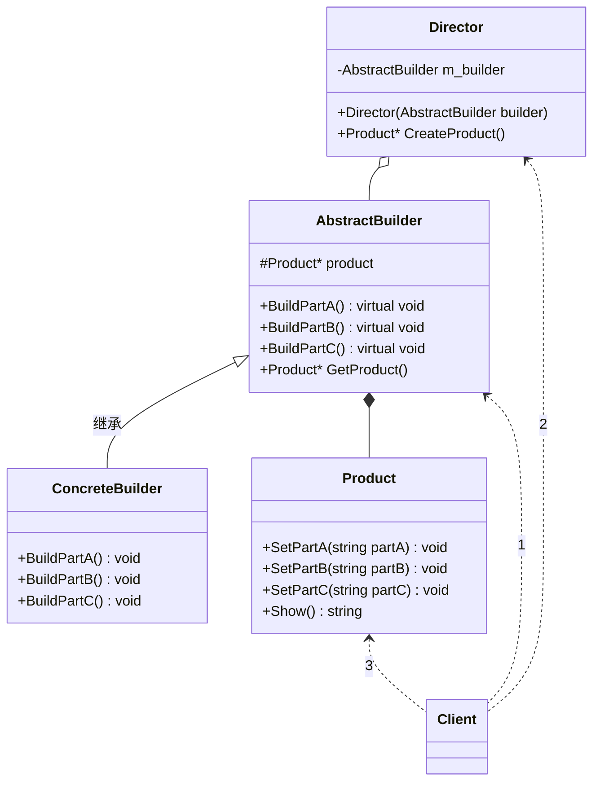

# 建造者模式（Builder）
**定义** ：将构建与表现分离，复杂的对象分解为多个简单的对象，然后一步一步构建成最终的复杂模块。相同的构建过程下不同的变现，各子模块的选择更具灵活性。

## 模式结构

* 抽象建造者（AbstractBuilder）：包含创建产品各个子部件的接口
* 具体建造者（ConcreteBuilder）：实现创建产品各子部件接口
* 指挥官（Director）：调用建造者对象中部件构造与装配方法组织如何将各简单的子部件组合成复杂的产品，不涉及具体产品信息
* 产品（Product）：各简单子部件组合成的复杂产品，有具体创建者创建各个零部件。

