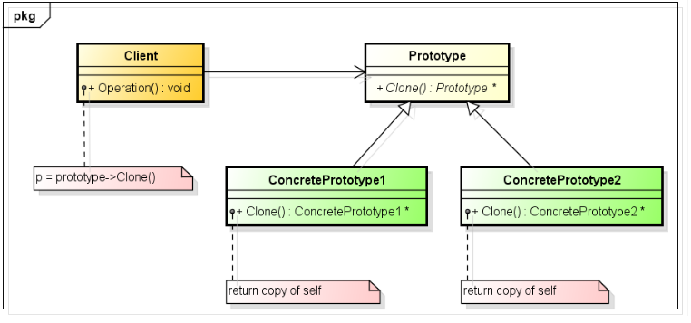

# 原型模式（Prototype）

**定义：** 
用一个已经创建的实例作为原型，通过复制该原型对象创建一个和原型相同或相似的新对象。

**优点：**
1. 通过复制已有类型的对象，无须知道对象的创建细节。
2. 可使用深克隆保存对象的状态，使用原型模式将对象复制一份，将状态保存。

**缺点：**
1. 每个类都配备一个可能方法，当对类进行拓展，将修改该代码，未被开闭原则。
2. 深克隆时，如果存在对象的嵌套引用，则每一层对象对应的类都需要支持深克隆。

## 使用场景
1. 对象类型并不是在开始就能确定，需要在运行阶段确定，则可通过原型模式复制该类型的对象克隆新的对象。
2. 保存对象状态的副本。例如：一个对象，经过一段处理之后，其内部的状态发生了变化；这个时候，我们需要一个这个状态的副本，如果直接new一个新的对象的话，但是它的状态是不对的，可以使用原型模式，将原来的对象拷贝一个出来，这个对象就和之前的对象是完全一致的了
3. 处理一些简单的对象，对象间的区别很小，可能就几个属性不同而已，那么就可以使用原型模式来完成，省去了创建对象时的麻烦了。
4. 创建对象时，构造函数的参数很多，而自己又不完全的知道每个参数的意义，就可以使用原型模式来创建一个新的对象，不必去理会创建的过程。

## 实现

1. 定义接口 
2. 具体原型需要实现 clone 方法，该方法通过调用具体类的拷贝构造函数完成克隆

**疑问：直接使用拷贝构造函数也可以用已有对象生成一个新的对象，为什么还要在外部封一个 clone？** 
原型模式是实现的 clone 接口，基于多态的 Clone 虚函数。在继承场景下，Clone 函数可以定义为虚函数。也就是说原型模式能够通过基类指针来复制派生类对象。拷贝构造函数完不成这样的任务。

**注意：** 由于是调用了拷贝构造函数，因此，对于复制生成新对象的需求不一，需要考虑深拷贝和浅拷贝的情况！！！
