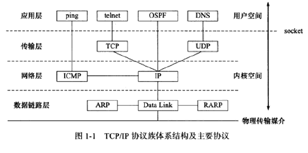
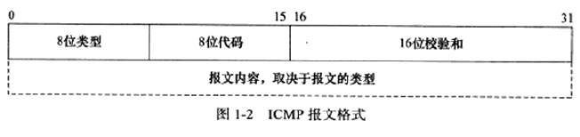
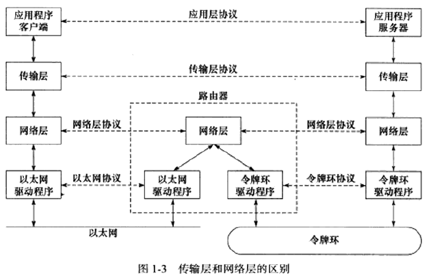
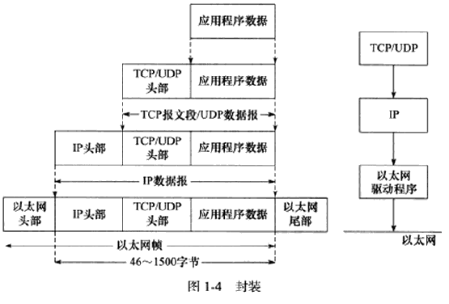
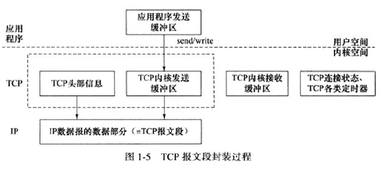
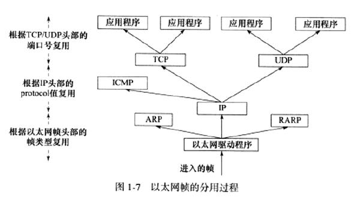

# 第一章 TCP/IP协议族
## 1、TCP/IP协议组结构

**分层、多协议的通信体系。**

自底向上分别为：数据链路层、网络层、传输层、应用层

### 数据链路层

作用：

​	不同的物理网络具有不同的电气特性，数据链路层实现网卡接口的网络驱动程序，隐藏这些细节，**向上层协议提供一个统一的接口，以处理数据在物理媒介上的传输(以太网、令牌环等)。**

相关协议：

**ARP(Address Resolve Protocol，地址解析协议 ) **

​	网络层通过IP地址寻找目标机器，数据链路层通过物理地址寻找目标机器，因此，网络层需要将IP地址转换为物理地址(ARP协议功能)才能使用数据链路层提供的服务

**RARP(Reverse Address Resolve Protocol，逆地址解析协议)**

​	仅用于网络上的无盘工作站，由于缺乏存储设备无法记录自己的IP地址，利用网卡上的物理地址向网络管理者(服务器或网络管理软件)查询自身IP地址(网络管理者存有该网络上所有机器的物理地址到IP地址的映射)。

实现IP地址和机器物理地址(MAC地址、以太网等)之间的相互转换。

	### 网络层

作用：**实现数据包的选路和转发。**

​	两台通信的设备间不是直接相连的，而是通过多个中间路由器连接，WAN(Wide Area Network, 广域网)通常使用众多分级的路由器来连接分散的机器或LAN(Local Area Network, 局域网)，网络层的任务是**选择中间节点，确定主机之间的通信路径** 与 **对上层协议隐藏网络拓扑连接的细节，使得上层看起来双方是直接连接的。**

相关协议：

**IP协议(Internet Protocol, 因特网协议)**

​	根据数据包的目的IP地址选择如何投递数据包。当不能直接到达目的机器时，寻找合适的下一跳路由器，通过该路由器来进行数据的转发，多次重复知道发送到目的机器或发送失败而丢弃。

**ICMP协议(Internet Control Message Protocol, 因特网控制报文协议)**

​	IP协议的补充，用于检测网络连接，严格意义不是网络层协议，因为使用处于同一层的IP协议提供的服务。

​	差错报文：用于回应网络错误，如目标不可到达(类型值为 3)和重定向(类型值为 5)

​	查询报文：查询网络信息，如：ping程序查看，目标是否可到达(类型值为 8)

### 传输层

作用：**只关心通信的起始端和目的端，为两台主机上的应用程序提供端到端的通信。**

* 数据链路层封装了物理网络的电气细节
* 网络层封装了网络连接的细节
* 传输层为应用层封装一条端对端通信的逻辑通信链路，负责数据的收发、链路的超时重传。

相关协议：

**TCP协议(Transmission Control Protocol, 传输控制协议)**

​	可靠的：TCP协议使用超时重传、数据确认等方式确认数据包被正确的发送至目的端

​	连接的：TCP通信双方必须建立TCP连接(三次握手)。

​	基于流的：数据没有边界限制，源源不断的从通信的一端流入另一端，发送端可以逐个字节的向数据流写入数据，接收端也可以逐个字节的将其读出。

**UDP协议(User Datagram Protocol, 用户数据报协议)**

​	不可靠：无法保证数据从发送端正确的传送到目的端，出错时(数据中途丢失、目的端数据校验发现数据错误将其丢失)只是简单通知应用程序发送错误。

​	无连接：通信双方不保持长久的联系，应用程序每次发送数据都要明确的指定接收端的地址。

​	基于数据报：每个UDP报文都有一个长度，接收端必须以该长度为最小单位将其所有内容一次性读出，否则数据将被截断。

使用UDP协议需要自己处理数据确认、超时重传等逻辑。

**SCTP协议(Stream Control Transmission Protocol, 流控制传输协议)**

​	因特网上传输电话信号设计的协议。

### 应用层

处理应用程序的逻辑，通常在用户空间实现。

**ping**：是应用程序，而不是协议，利用ICMP 报文检测网络连接，是调试网络环境的必备工具。
**telnet协议**：是一种远程登录协议，它使我们能在本地完成远程任务。
**OSPF(OpenShortest Path First开放最短路径优先)协议**：是一种动态路由更新协议，用于路由器之间的通信，以告知对方各自的路由信息。
 **DNS(Domain Name Service域名服务)协议**：提供机器域名到IP 地址的转换。
应用层协议(或程序)可能跳过传输层直接使用网络层提供的服务，比如ping程序和 OSPF协议。

应用层协议(或程序)通常既可以使用TCP服务，又可以使用UDP服务，比如 DNS协议。

## 2、封装

上层协议使用下层协议服务的方式，应用程序数据在发送到物理网络上之前，将沿协议栈从上往下依次传递，每层协议都将在上层数据的基础上加上自己的头部信息。

TCP报文段：TCP封装后的数据，TCP为通信双方维持连接在内核中存储相关数据，该数据与TCP头部信息一起构成了TCP报文段，内核中保存用户数据的副本。

UDP数据报：UDP封装后的数据，UDP无需为应用层数据保存副本，当发送成功内核缓冲区的数据包就被丢弃，未被成功接收并打算重发这个数据报时，应用程序将重新从用户控件将数据拷到UDP内核缓冲区中。

IP数据报：IP封装后的数据，包括头部信息和数据部分(TCP报文段、UDP数据报或ICMP报文)

帧：数据链路层封装的数据，传输介质不同，帧的类型不同。通过6字节的目的物理地址和6字节的源物理地址表示通信双方。

帧的最大传输单元(MTU)：帧最多能携带多少上层协议数据，过多的数据报可能需要分片传输。

## 3、分用

封装的逆过程，当帧到达目的机器，将沿协议栈自底向上依次传递，各层协议依次处理帧中本层负责的头部受获取所需信息，将最后的帧交给目标应用程序。依靠头部信息中的类型字段实现。

## 4、ARP协议工作原理

ARP协议可以实现任意网络层到任意物理层地址的转换。

**原理：**主机向自己所在网络广播一个ARP请求，该请求包含目标及其的网络地址，该网络上的机器都将收到这个请求，但只有被请求的目标机器会回应一个ARP应答，其中包含其物理地址。

ARP高速缓存：ARP维护一个高速缓存，其中包含经常访问或最近访问的机器的IP地址到物理地址的映射，避免了重复发送ARP请求，提高了发送数据包的速度。

arp -a：查看ARP的动态高速缓存

sudo arp -d IP地址：删除某IP地址到物理地址的映射，删除ARP缓存

sudo arp -s IP地址	物理地址：添加某IP地址对应的ARP缓存

## 5、DNS工作原理

访问英特网上各种网站常常通过域名而不是IP来访问。域名查询服务提供将机器域名转换成IP地址，通常为NIS(网络信息服务)、DNS和本地静态文件等。

DNS 是一套分布式的域名服务系统，每个DNS服务器上都存放大量的机器名和IP地址的映射，并且动态更新，网络客户端程序都是用DNS协议来向DNS服务器查询目标主机的IP地址。

## 6、Socket 与 TCP/IP 协议栈的关系

1. socket是一套通用网络编程接口，不但可以访问内核中TCP/IP协议栈，而且可以访问其他网络协议栈。
2. 系统调用API，使用户可以使用数据链路层、网络层、传输层的内核实现(从用户缓冲区复制数据到TCP/UDP内核发送缓冲区 或 从TCP/UDP接收缓冲区复制数据到用户缓冲区)。
3. 修改内核中各层协议的头部信息或其他数据结构，从而精细的控制底层通信行为(setsockopt设置IP数据包在网络的存活时间)。

