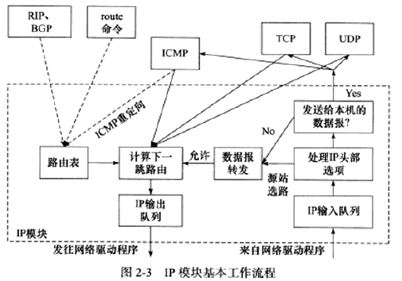

# 第 2 章 IP协议简介

**IP协议知识点：**

* IP 头部信息：指定IP通信的源端IP地址、目的端IP地址，指导IP分片、重组和部分通信行为
* IP 数据报的路由和转发：数据报的路由和转发发生在除目标机器之外的所有主机和路由器上，决定数据包是否应该转发以及如何转发。


## 1、IP 服务的特点

* **无状态：** 各IP 数据包的发送、传输和接收相互独立，通信双方不同步传输数据的状态信息。
* **无连接：** IP 通信双方不长久的维持对方的任何信息，上层协议每次发送数据时，都需要明确指定对方IP地址。
* **不可靠：** IP 协议不保证数据报能准确到达接收端，错误时返回ICMP错误信息通知上层协议发送失败，而不会试图重传。

IP 数据报头部提供了唯一标识一个IP数据报的标识字段，但是用来处理IP分片和重组的，为保证有序、无重复还是需要面向连接的协议来处理。


#### 优点：

​	无状态的特点使得无须为保持通信状态而分配一些内核资源，也无须在每次传输中携带状态信息，简单、高效。


#### 缺点：

1. 无状态的特点使得IP数据存在乱序和重复的现象。
2. 需要上层协议处理数据确认、超时重传


## 2、IPV4 头部结构


## 3、分片

​	当IP 数据报的长度超过帧的MTU(以太网帧MTU为1500字节)，将被分片传输。分片可能发生在发送端、中专路由器以及在传输过程中被多次分片，到最终的目标机器中，这些分片将被内核中的IP 模块重新组装。


数据报标识：每个IP 数据报的分片都具有自己的IP 头部，具有相同的标识值

标识：除最后一个分片，其他的分片将设置MF 标志

片偏移：每个分片具有不同的片偏移


## 4、IP 路由

​	路由：IP 协议的核心任务，决定发送数据报到目标机器的路径。



从右至左：

1. IP 模块接收到数据链路层的IP数据报，先对数据报做CRC检验，确认无误后分析头部信息。
2. 如果IP 数据报头部信息设置了源站选路选项(松散源路由选择或严格源路由选择)，则IP 模块调用数据报转发模块处理该数据报
3. 如果IP 数据报里的目标IP 地址是本机的某IP 地址或是广播地址，则表示该数据报是发送给本机的，IP 模块根据头部信息分析应该发送给哪种上层应用；如果发送给本机的数据报，则也是调用数据报转发模块处理该数据报。
4. 数据报转发模块先检测系统是否允许进行转发，不允许则丢弃该数据报，允许则进行下一步。
5. “计算下一跳路由”模块将决定IP 数据报将发送给哪个下一跳路由以及通过哪个网卡发送 => 路由过程
6. 路由表将根据数据报的目标IP 地址分类，同一类型的IP 数据报将被发往相同的下一跳路由去。是IP 模块实现数据报路由的核心数据结构。
7. IP 输出队列是所有等待发送的IP 数据报，不仅仅包括需要转发的IP 数据报哇哦，还包括封装本机上层数据(TCP报文段、UDP报文段、ICMP报文段)的IP 数据报

### 路由机制

路由表将通过3步对目标IP 地址进行分类：

1. 在路由表中查找与目标数据报IP 地址完全匹配的主机IP 地址，找到则使用该路由项，未找到执行下一步。
2. 查找路由表中和数据报的目标IP 地址具有相同网络ID的网络IP 地址，找到则使用该路由项，没找到执行下一步。
3. 选择默认路由项，即数据报的下一跳路由是网关。


### 路由表更新

​	路由表必须能更新，反应网络连接的变化，这样IP 模块才能准确、高效的转发数据报。

```C++
sudo route add -host 192.168.1.xx dev eth0  // 添加xx对应的路由项
sudo route del -host 192.168.1.0 netmask 255.255.255.0//删除192.168.1.0对应路由项
sudo route del default//删除默认路由项，则无法访问因特网
sudo route add default gw 192.168.1.xx dev eth0//重新设置默认路由项
```

​	通过`route命令`和其他工具手动修改路由表是静态的路由更新方式，还有BGP(边际网关协议)、RIP(路由信息协议)、OSPF等协议动态、自动更新。


## 5、IP 转发

1. 检查数据报头部的TTL 值，如果为0，则丢弃该数据报。
2. 查看数据报头部是否设置严格源路由选择选项。如果被设置，检测数据报的目标IP 地址是否是本机的某个IP 地址，如果不是，则发送ICMP源站选路失败报文给发送端。
3. 如果有必要，则给源端发送一个ICMP重定向报文，告诉其更合理的下一跳路由器。
4. TTL 值减 1
5. 处理 IP 头部选项
6. 如果有必要，则执行 IP 分片操作。