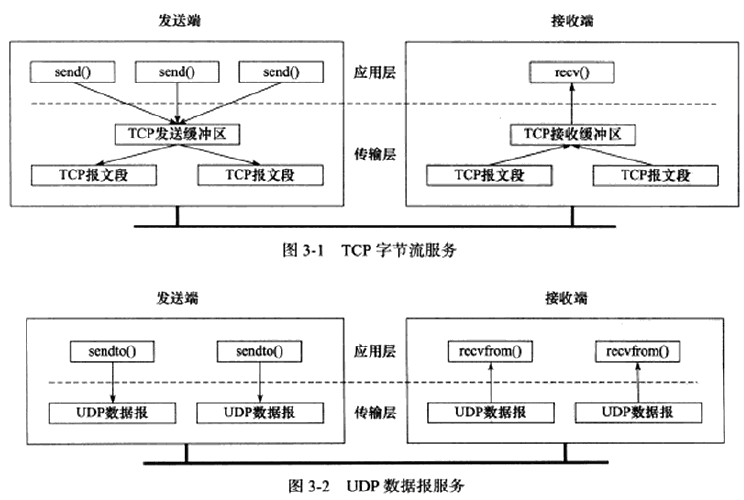
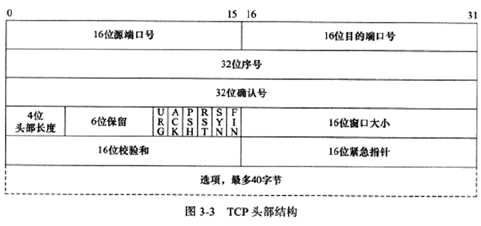
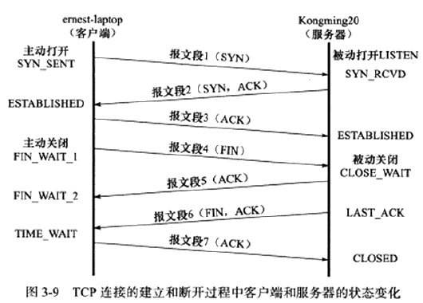
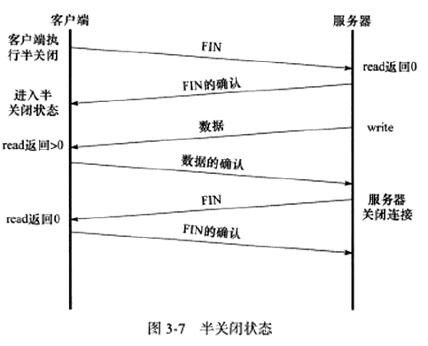
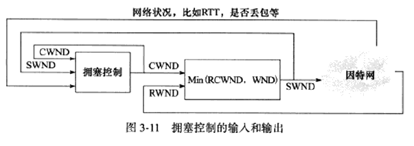

# 第 3 章 TCP 协议简介

**TCP 协议知识点：**

* TCP 头部信息：用于指定通信的源端端口号、目的端端口号，管理TCP连接，控制两个方向的数据流
* TCP 状态转移过程：TCP 连接的任意一端都是状态机，从建立到断开将经历不同的状态变迁
* TCP 数据流：讨论交互数据流和成块数据流以及特殊的紧急数据
* TCP 数据流控制：讨论超时重传和拥塞控制

## 1、比较 TCP 与 UDP

* **TCP 面向连接**，连接是一对一的，不适用于广播和多播（目标是多个主机地址），而**无连接的 UDP** 适合
* **TCP 是基于字节流服务**，内核中设立读/写缓冲区，因此发送端写入的次数与接收端读取的次数没有固定关系；而 **UDP 基于数据报服务**，发送端每写入一次，UDP 模块将封装成一个 UDP 数据报并发送，接收端就读取一次。
* **TCP 可靠传输，采用发送应答机制**，发送端的每个 TCP 报文段都必须接收到接收方应答；并且在发送的同时启动定时器，如果规定时间未收到应答将 **超时重传**；TCP 报文段使用 IP 数据报发送，IP数据报可能存在无序、重复的现象，TCP 协议将对接收到的 TCP 报文段重排、整理再交付应用层。
* **UDP 不可靠传输，** 与 IP 协议一样，需要上层协议处理数据确认和超时重传。

## 2、TCP 头部结构

### 固定头部选项

1. 16位端口号：告知接收主机该报文段来自哪里（源端口）以及传给哪个上层协议或应用程序（目的端口）
2. 序号：TCP 通信过程中字节流中每个字节的编号，首次 TCP 报文段中该初始值为系统分配的随机值，后续 TCP 报文段中该值为该初始值加上该报文段携带的第一个字节在整个字节流的偏移（即加上前一个报文段数据的长度）
3. 确认号：用作对另一方发送来的 TCP 报文段的确认响应，值为接收到的 TCP 报文段的序号值加 1
4. 头部长度：标识该 TCP 头部有多少4字节，由于是4bit，因此 TCP 头部最长为60字节
5.  6位保留
6.  6位标志位
   * URG 标志：表示紧急指针是否有效。
   * ACK  标志：表示确认号是否有效，携带 ACK 标志的 TCP 报文段为确认报文段。
   * PSH  标志：提示接收端应用程序应该立刻从 TCP 接收缓冲区将数据读走，为接收后续数据腾出空间
   * RST  标志：要求对方重新建立连接，携带该标志的 TCP 报文为复位报文段。
   * SYN  标志：表示请求连接，携带该标志的 TCP 报文段为同步报文段。
   * FIN   标志：通知对方本段要关闭连接，携带该标志的 TCP 报文为结束报文段
7. 窗口大小：TCP 流量控制的手段，窗口指接收通告窗口(RWND)，告知对方本段的 TCP 接收缓存区还能容纳多少字节，对方就可以控制发送数据的速度。
8. 校验和：发送端填充，接收端对 TCP 报文执行 CRC 检验，可靠传输的保障。
9. 紧急指针：正偏移量，相对当前序号值的偏移，用于发送端向接收端发送紧急数据，与当前序号值之和表示最后一个紧急数据的下一字节的序号。

## 3、连接与关闭过程的状态转换

[浅谈TCP三次握手、四次挥手](https://blog.csdn.net/qq_41917618/article/details/117429095?spm=1001.2014.3001.5501)

**客户端直接从 FIN_WAIT_1 进入 TIME_WAI：**处于 FIN_WAIT_1 状态的客户端直接收到服务端带有确认信息的结束报文，即省略上图报文段 5 ，直接接收到报文段 6。

**孤儿连接：** 客户端执行半关闭后，未等服务器关闭连接就强行退出了，客户端将连续停留在 FIN_WAIT_2 状态，客户端连接交由内核管理，称为孤儿进程（/proc/sys/net/ipv4/tcp_max_orphans 指定内核能接管孤儿连接的数目；/proc/sys/net/ipv4/tcp_fin_timeout 指定内核中孤儿连接生存的时间）

### TIME_WAIT 状态

客户端在接收到服务端发送的结束报文段后并没有直接进入**CLOSED**状态，而是转为**TIME_WAIT**状态。在该状态持续**2MSL**时间后才能完全关闭。（MSL：报文段最大生存时间，超过这个时间还没有到达目标主机就会被丢弃，并通知源主机，标准文档建议值 2 min）

**2MSL：**确保网络上两个传输方向

**作用：**

* 可靠的终止 TCP 连接：如若确认服务端结束连接的确认报文 7 丢失，服务端将重传结束报文段，客户端需要处于某种状态以处理重复的结束报文，如果没有TIME_WAIT状态，客户端将发送复位报文，服务器接收到并不是想要的确认报文段认为是一个错误。
* 保证让迟来的 TCP 报文段有足够的时间被识别并丢弃，确保建立新的连接：一个 TCP 端口不能被同时打开两次及以上，当 TCP 连接处于 TIME_WAIT 状态，无法立即使用该连接的端口去建立新的连接。（如果没有 TIME_WAIT 状态，则能建立一个相同 IP 地址和端口号的连接，新的连接却还能接收原来连接迟到的 TCP 报文段）

### 半关闭状态

TCP 连接是全双工的，允许连接双方被独立的关闭。通信的一端可以发送结束报文通知另一端本端已经完成了数据的发送，此时，结束报文段发送端任然可以接收来自对方的数据，直到对方发送结束报文段以关闭连接，处于的这种状态为 TCP 连接的半关闭状态。

通信双方判断对方是否已经关闭连接的方法是 read 系统调用返回 0(收到结束报文)

socket 编程中的 shutdown 函数提供对半关闭的支持。 

### 连接超时

如果客户访问一距离很远的服务器或因为网络繁忙，导致客户端没有结束到来自服务器的应答， TCP 将先进行重连，如重连无效则通知应用程序连接超时。

## 4、复位报文段

某些特殊情况， TCP 连接的一端会向另一端发送带有 RST 标志的复位报文段，通知对方关闭连接或重新建立连接。

1. 访问不存在的端口或端口被处于 TIME_WAIT 状态的连接占用。
2. 异常终止连接：TCP 提供异常终止的方法，即给对方发送一个复位报文段，一旦发送完复位报文段，发送端所有排队等待发送的数据都将被丢弃。(socket 选项 SO_LINGER)
3. 处理半打开连接：服务端(或客户端)关闭或异常终止了连接，而对方没有接收到结束报文段，因此，客户端(或服务端)还维持原来的连接，即便服务端(或客户端)重启，也没有任何的连接信息，服务端(或客户端)处于半打开状态，当客户端往半打开状态的连接写入数据，对方将回应一复位报文段。

## 5、TCP 数据流

TCP 报文段对所携带的应用程序数据按长度分为：交互数据和成块数据

### 交互数据

包含很少的字节，对实时性要求高，如：telnet、ssh等。

延迟确认：不马上确认收到的数据，在一段延迟时间后查看本端是否有数据需要发送，如果有，则和确认信息一起发出。延迟确认可以减少发送 TCP 报文段的数量。

广域网上交互数据流可能有很大的延迟并且携带交互数据的微小 TCP 报文段数量很多，将导致**拥塞**，可使用 Nagle 算法解决(TCP 通信双方任意时刻都只能发送一个未被确认的 TCP 数据报)。

### 成块数据

长度通常为 TCP 报文段允许的最大数据长度，对传输效率要求高，如：ftp

当传输大量大块数据时，发送方会连续发送多个 TCP 报文段，接收方可以一次确认所有这些报文段；发送方在接收上一次确认后能连续发送多少 TCP 报文段由接收通告窗口(还需考虑拥塞窗口)大小决定

### 带外数据

* 用于通知对方本端发生了重要的事情
* 带外数据比带内数据优先级更高，应该总是立即被发送而不论发送缓冲区是否有排队等待发送的普通数据
* 带外数据可以使用独立的传输层连接传输

telnet、ftp等使用，UDP 和 TCP 没有实现，但 TCP 利用头部的紧急指针标志和紧急指针给应用程序提供一种紧急方式达到相似的效果，不过 TCP 的紧急方式将采用普通数据传输的方式来传输 

**TCP 传输紧急数据：**

1. 写入紧急数据后，待发送的 TCP 报文段头部将设置 URG 标志，并紧急指针被设置为指向最后一个带外数据的下一字节。
2. 如果发送端一次发送多字节的紧急数据，只有最后一字节被当作紧急数据，而其他将当作普通数据。
3. 如果 TCP 模块以多个 TCP 报文段来发送缓冲区中的紧急数据，则每个 TCP 报文段都将设置 URG 标志，紧急指针指向同一位置，但只有一个 TCP 报文段真正携带紧急数据。

**TCP 接收紧急数据：**

1. 对设置了 URG 标志的报文段， TCP 模块才检查紧急指针
2. 根据紧急指针所指位置确定紧急数据的位置
3. 将紧急数据读取到特殊的缓存中(外带缓存)，大小只有 1 字节，如果未及时读取，将被后续的数据覆盖
   * 设置 TCP 连接的SO_OOBINLINE 选项，紧急数据将和普通数据一样被放在接收缓冲区，使用紧急指针确定紧急数据的位置及使用 socket 提供的系统调用识别紧急数据。

## 6、TCP 超时重传

TCP 模块为每个报文段都维护一个重传定时器，定时器在 TCP 数据报第一次被发送时启动，当到超时时间内没有收到接收方的应答，TCP 模块将重传 TCP 报文并重置定时器。(c重置后的定时器超时时间将根据重传策略决定)

超时将导致 TCP数据报重传，但 TCP 重传也会发生在超时之前，即快速重传。

## 7、拥塞控制

参考 TCP 拥塞控制标准文档 RFC 5681

**作用：** 提高网络利用率、降低丢包率并保证网络资源对每条数据流的公平性。

**SWND(Send Window,发送窗口)：**拥塞控制的最终受控变量，表示发送端向网络一次连续写入（手动起哄第一个数据的确认之前）的数据量；以 TCP 报文段发送就是发送端连续发送的 TCP 报文段数量。

**SMSS(Sender Max Segment Size,发送者最大段大小)：** TCP 报文段的最大长度(仅数据部分)，一般等于MSS

发送者需要合理选择 SWND 的大小，太小会引发网络延迟，太大会引发网络拥塞。虽然接可以通过接收方的**RWND(接收通告窗口)** 来控制发送端的 SWND，但显然不够，引入了**拥塞窗口(CWND)**  的状态变量。**SWND = Min(RWND, CWND)**

### 慢启动和拥塞避免

传输超时或者 TCP 重传定时器溢出时采用

### 快速重传和快速恢复

接收到重复的确认报文段时采用(发送端连续收到 3 个重复的确认数据报文段就认为拥塞发生)。

