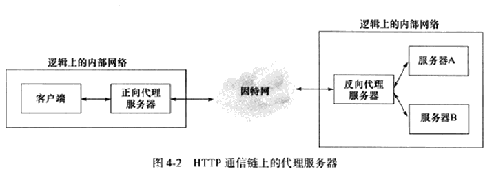
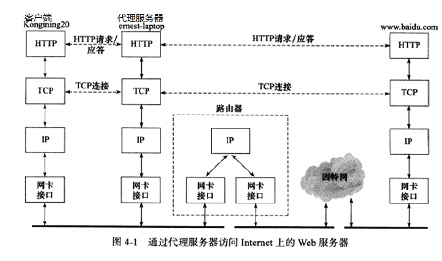
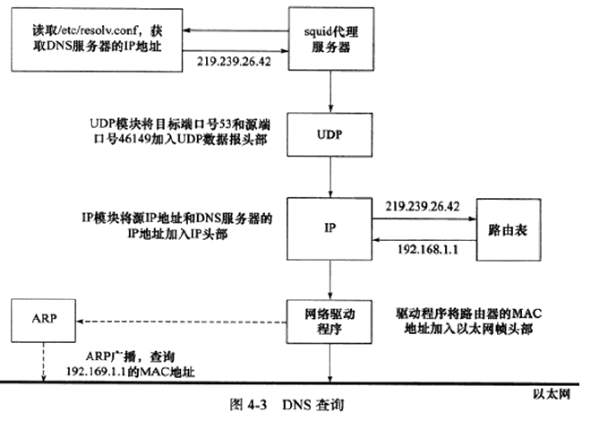
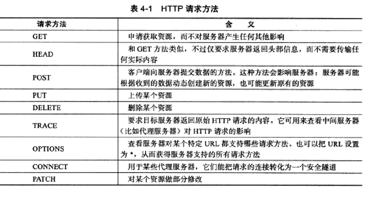
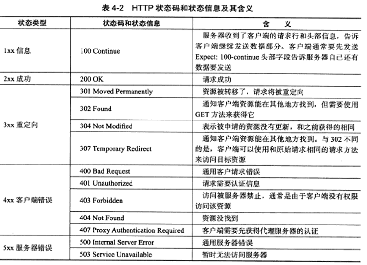

# 第 4 章 TCP/IP 通信案例：访问 Internet 上的 Web 服务器

## 0、代理服务器

HTTP 通信链路上，客户端与目标服务器之间存在某些中转代理服务器用于对目标数据的中转访问。一个 HTTP 请求可能被多个代理服务器转发，后面的服务器称为前面服务器的 **上游服务器** 。按使用和作用分为：

*  正向代理服务器：客户端配置代理服务器的地址，客户的每次请求将直接发送给该代理服务器，由该代理服务器去访问 Internet 请求目标资源。（处于防火墙内的局域网机器想访问 Internet、访问被屏蔽的国外网站等使用）
* 反向代理服务器：设置在服务器，客户端无需配置，用代理服务器接收来自 Internet 的连接请求，并转发给内部网络上的服务器处理，将得到的结果作为目标资源返回给客户端，代理服务器对外表现为一真实服务器
* 透明代理服务器：只能设置在网关上，而用户访问 Internet 必然经过网关，对用户来说是透明的，可看作正向代理的特殊情况

正向代理与客户端处于同一逻辑网络（本地 LAN 或更大网络）；而反向代理与真正的 Web 服务器处于同一逻辑网络，有提供网站的公司配置和管理。

不同地域 ping 同一域名可能得到不同的 IP 地址，因为不同地域具有不同的代理服务器，ping 得到的是代理服务器的 IP

## 1、步骤分解

该案例的数据包传输不再是在一对客户端和服务器上进行，而是客户端与代理服务器以及代理服务器与 Web 服务器之间通信。分解为以下部分：

* 代理服务器通过 本地查询 或 DNS 服务查询想要访问域名 www.baidu.com 对应的 IP 地址
* 代理服务器调用 ARP 的请求与应答获取 IP 对应的 MAC 地址
* 客户端与代理服务器的 HTTP 通信
* 代理服务器与 Web服务器之间的 HTTP 通信

## 2、本地名称查询

通过主机名来访问本地局域网上的机器，可以通过本地的静态文件获取该主机的 IP 地址，保存在 ``/etc/hosts`` 文件中，如果在该文件中没有找到目标机器名对应的 IP 地址，将求助于 DNS 服务。

## 3、访问 DNS 服务器

通过域名来访问 Internet 上的某台主机时，将通过 DNS 服务来获取该主机的 IP 地址，因此，需要访问 DNS 服务器获取相关信息。

1. 读取 ``/etc/resolv.conf`` 获取 DNS 服务器 IP （首选 DNS 服务器 IP），交由 UDP 模块。
2. UDP 模块将本端源端口以及 DNS 服务器的端口填充 UDP 报文段头部，并将 DNS 查询报文封装成 UDP 报文段，交由 IP 模块。
3. IP 模块将本端源 IP 地址以及 DNS 服务器 IP 地址填充入 IP 数据报头部，将UDP 报文段封装成 IP 数据报。接着通过 DNS 服务器 IP 地址去查询路由表以确定如何对数据进行传递。（如图，只能通过默认路由项发送）
4. 将 IP 数据报发送至路由器（192.168.1.1），再由路由器进行转发。
5. 因为可能 ARP 高速缓存中没有记录该路由器的缓存，因此，调用 ARP 广播获取该路由对应的 MAC 地址，后续使用将存在该路由 IP 到 MAC 的映射。
6. 网络驱动程序将 IP 数据报封装成帧进行发送。

虽然 IP 数据报先是发送到路由器，再有路由器进行转发，但头部信息中的源 IP 地址和目标 IP 地址保持不变，不受中转路由器的影响。但数据帧在发送时，头部的物理源地址以及目的地址一致在改变。

## 4、HTTP 通信

### HTTP 请求

GET、HEAD、OPTIONS、TRACE、PUT、DELETE被认为是等幂的，即多次连续、重复的请求和只发送一次该请求具有完全相同的效果。POST的连续多次发送同一个请求可能会影响服务器上的资源。

**短连接：** 旧的 HTTP 协议中， Web 客户端与服务端之间一个 TCP 连接只能为一个 HTTP 请求服务，当处理完后 TCP 连接将关闭，同一客户如果要连续多个 HTTP 请求不能共用一个 TCP 连接。

**长连接：** 客户端的多个请求可以使用同一个 TCP 连接完成。

### HTTP 应答

HTTP 协议是无状态的协议，数据之间相互独立。如果服务器处理后续 HTTP请求需要用到之前的数据，客户端必须重传，导致传递了更多的数据

**Cookie：** 服务端发送给客户端的特殊信息（通过 HTTP 应答的头部字段“Set-Cookie”）,保持 HTTP 连接状态的特殊手法，客户端每次向服务器发送请求都需要带上，用于区分不同的客户。

