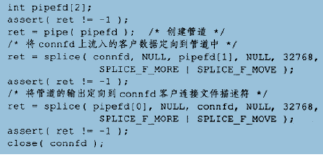
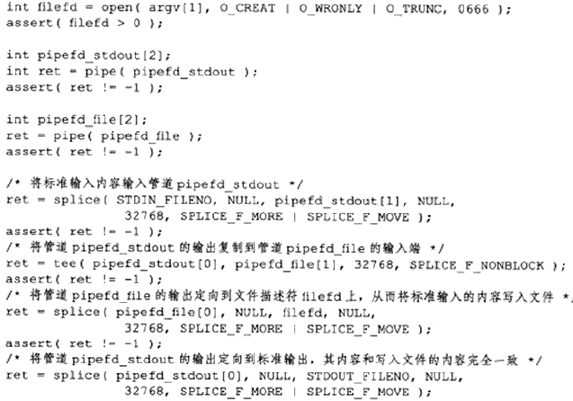
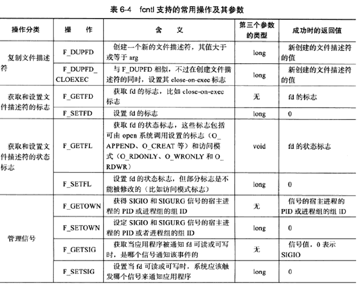
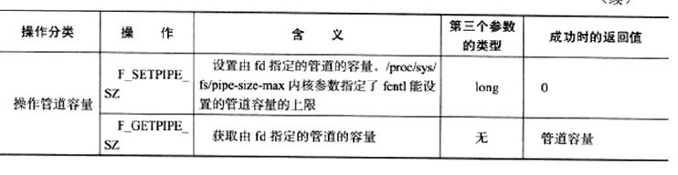

# 第 6 章 高级 I/O 函数

讨论与网络编程有关的高级I/O函数：

* 用于创建文件描述符的函数（pipe/dup/dup2 函数）
* 用于读写数据的函数（readv/writev/sendfile/mmap/munmap/splice/tee 函数）
* 用于控制I/O行为和属性的函数，fcntl 函数


## 1、pipe 函数

```C++
#include <unistd.h>
/**
	成功返回0，并将一打开的文件描述符值填入其参数指向的数组
	失败返回-1，并置errno
*/
int pipe(int fd[2]);
```


* fd[0] 只能从管道里读数据，fd[1] 只能往管道里写数据，构成管道的两端
* 管道内部传输的数据是字节流，默认容量限制为65536字节，可通过fcntl 修改管道容量
* 默认情况为阻塞，当read一个空管道，以及往一个满的管道里write，都将阻塞等待有数据可读或直到管道有空余空间可用
* 写端文件描述符的引用计数为0，读端read将返回0，表示读到文件结束标志**EOF** ；读端文件描述符引用计数为0，写端继续write讲失败并发出 **SIGPIPE 信号** 


### 创建双向管道

``` C++
#include <sys/types.h>
#include <sys/socket.h>
/**
	domain:只能使用UNIX本地域协议族 AF_UNIX
	type: 使用的具体服务：数据流/数据报
	protocol: 具体的协议，一般为0，表示默认
	fd: 与pipe 调用一致，不过该对文件描述符可读可写
	成功返回0，失败返回-1，并置errno
*/
int socketpair(int domain, int type, int protocol, int fd[2]);
```


## 2、dup 函数和 dup2 函数

将标准输入重定向到一个文件，或将标准输出重定向到一个网络连接。

```C++
#include <unistd.h>

/**
	使用当前系统可用的最小文件描述符值创建一个oldfd文件描述符的副本，
	与oldfd指向相同的文件、管道或网络连接
	成功返回新文件描述符值，失败返回-1并置errno
*/
int dup(int oldfd);
/**
	功能与dup一致，但新的文件描述值将使用newfd的值，如果newfd文件描述符之前已经被使用，在使用前将静默关闭，关闭和重用文件描述符	newfd的步骤是自动执行的。这一点很重要，因为试图使用close(2)和dup()实现等价的功能会受到竞争条件的影响，因此newfd可能会在关	闭和重用之间被重用或者是因为并行线程分配了一个文件描述符。  
	
	oldfd为非法文件描述符，调用失败，newfd不关闭
	oldfd为合法文件描述符，但newfd = oldfd,则什么都没做，返回newfd
*/
int dup2(int oldfd, int newfd);
----------------------------------------------
//dup 和 dup2 不继承原文件描述符属性
----------------------------------------------
    
#include <fcntl.h>
#include <unistd.h>

/**
	与dup2功能一致，但可以通过flags强行设置新文件描述符的属性
	newfd = oldfd,将调用失败返回错误 EINVAL
*/
int dup3(int oldfd, int newfd, int flags);

```


## 3、readv 函数和 writev 函数

```C++
#include <sys/uio.h>

/**
	从文件描述符fd中读取数据存放在count个iovec结构中，分散读
	成功返回读取fd的字节数，失败返回-1，置errno
*/
ssize_t readv(int fd, const struct iovec* vector, int count);

/**
	将存放在count个iovec结构中的数据写入文件描述符fd中，集中写
	成功返回写入fd的字节数，失败返回-1，置errno
*/
ssize_t writev (int fd, const struct iovec* vector, int count);
```


## 4、sendfile 函数

在两个文件描述符之间直接传递数据(内核中操作)，避免了内核缓冲区和用户缓冲区之间的数据拷贝，实现 **零拷贝**

```C++
#include <sys/sendfile.h>
ssize_t sendfile(//待写入数据的文件描述符，必须指向一socket文件描述符
    			 int out_fd,
     			 //待读取数据的文件描述符，
    			 //必须是能支持类似mmap函数的文件描述符，即指向真实文件,不能为socket、管道
                 int in_fd,
    			 //从输入文件流的哪个位置开始读，为NULL时采用文件流默认的起始位置
                 off_t* offset,
    			 //两个文件描述符之间传递数据的字节数
                 size_t count
                );
//由out_fd和in_fd的性质可知，sendfile专门用于网络传输文件设计
//对比于readv/writev，没有为目标文件分配任何用户空间的内存和文件的读取操作，同样实现文件传输
```


## 5、mmap 函数和 munmap 函数

```C++
#include <sys/mman.h>

/**
	mmap 函数用于申请一段内存空间，作为进程间通信的共享内存，也可以将文件映射到其中。
	成功返回指向目标内存区域的指针，失败返回MAP_FAILED并置errno
*/
void* mmap(//内存地址的起始地址，接受用户使用特定地址，NULL则系统分配地址
    	   int start,
    	   //内存段的长度
           size_t length,
           //访问权限：PORT_READ/PORT_WRITE/PORT_EXEC/PORT_NONE(内存段不能被访问)
           int port,
    	   //控制内存段内容被修改后程序的行为
           int flags,
           //被映射的文件描述符
           int fd,
           //从文件的何处开始映射
           off_t offset
          );

/**
	munmap 函数用于释放掉该段内存。
	成功返回0，失败返回-1并置errno
*/
int mmap(void* start, size_t length);
```


## 6、splice 函数

两个文件描述符之间 **移动** 数据，未涉及用户空间和内核空间之间的数据拷贝，**零拷贝** 

```C++
#include <fcntl.h>

/**
	in_fd: 待输入数据的文件描述符
	off_in:
		if(in_fd为管道文件描述符)	必须置NULL
		else 表示从输入数据流的何处开始读取数据，
			NULL表示当前偏移量读入，非NULL指出具体偏移位置
	out_fd/off_out:针对输出数据流，含义与以上相同
	len: 文件描述符间移动数据的长度
	flags: 控制如何移动数据
	注意：in_fd和out_fd 必须至少有一个是管道文件描述符
	成功返回移动数据的字节数，失败-1置errno
*/
int splice(int in_fd, loff_t* off_in, int out_fd, loff_t* off_out, size_t len, unsigned int flags);
```


回射服务器，将客户端发送的数据返回给客户端：




## 7、tee 函数

在 **两个管道文件描述符之间复制数据** ，不消耗数据，源文件描述符上的数据仍然可以用于后续的读操作。

```C++
#include <fcntl.h>
/**
	in_fd：待读取的管道文件描述符
	out_fd: 待写入的管道文件描述符
	参数意义与splice一致
	成功返回两文件描述符之间复制的字节数，0表示没有复制任何数据
	失败-1置errno
*/
ssize_t tee(int in_fd, int out_fd, size_t len, unsigned int flags);
```


实现 tee程序(同时输出数据到终端和文件的程序)




## 8、fcntl 函数

对文件描述符的各种控制操作，相应的也有 iocntl 系统调用。

```C++
#include <fcntl.h>
/**
	fd: 被操作的文件描述符
	cmd: 操作类型，根据操作类型决定是否有第三个参数arg
*/
int fcntl(int fd, int cmd, ...);
```






**SIGIO 和 SIGURG** 需要和某个文件关联使用，当被关联的文件描述符可读或可写是，系统触发 SIGIO；被关联的socket文件描述符有带外数据时发送 SIGURG。

关联方法：使用fcntl为目标文件描述符指定宿主进程或进程组，则指定的进程或进程组将捕获这两个信号(SIGIO 还需要fcntl设置其 O_ASYNC 异步标志，虽然SIGIO并非真正意义的异步I/O)

