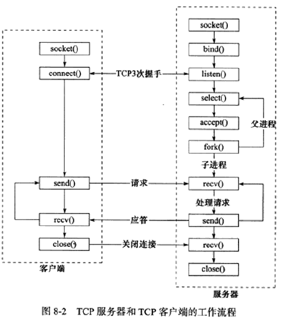
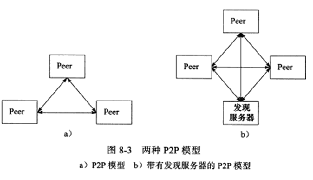
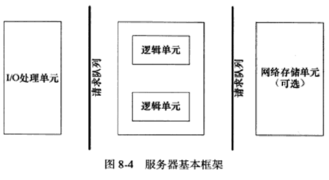
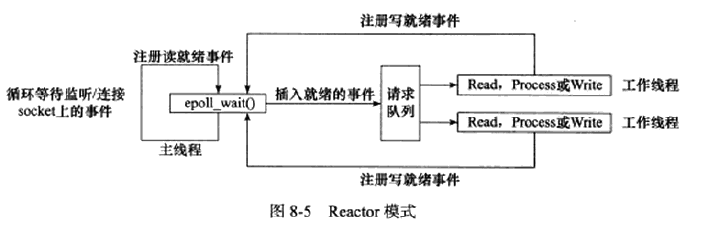
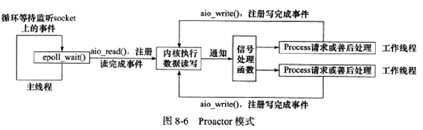

# 第 8 章 高性能服务器程序框架

## 1、服务器模型

### C/S 模型

所有客户端都是通过访问服务器来获取所需的资源。

服务器创建一个或多个监听套接字，调用 bind 绑定服务器感兴趣的端口后调用 listen 等待客户的连接，由于客户调用 connect 进行连接是随机的异步事件，所以服务器需要 I/O 模型来监听（此图使用了 I/O 复用的 select 系统调用），当监听到新的连接，通过 accept 返回监听队列的连接并通过 fork 调用创建子进程来给其分配新的逻辑单元（子进程、子线程或其他方式都可以），在该逻辑单元中处理客户的请求以及返回结果，而父进程继续负责监听其他客户的请求（避免出现必须处理完前一个客户请求才能处理下一个客户请求的串行服务器），同时监听多个请求通过 select 系统调用实现。

**特点：** 

* 资源集中在服务器是通信的中心，实现简单。
* 当访问量过大，可能客户将得到很慢的响应。

### P2P 模型(点对点)

**特点：**

* 在消耗服务的同时也提供服务，即是客户端又是服务端，而不是以服务器为中心。
* 充分、自由的分享资源。（云计算机群）
* 当用户之间请求过多时，网络负载将加重。
* 主机之间很难互相发现，通常带有以专门的发现服务器，提供查找服务使客户尽快找到需要的资源。

## 2、服务器编程框架

以上内容对于一台服务器和服务器机群各部件含义如下：

**I/O 处理单元** 

* 单服务器：等待并接受客户连接，接收客户数据并将服务器响应数据发送给客户
* 服务器机群：作为接入服务器，选择所有逻辑服务器中负荷最小的来服务新客户，实现负载均衡

数据的收发不一定在 I/O 处理单元，也可能直接在逻辑单元中直接就发送了，取决于 **事件处理模式**

**逻辑单元**

* 单服务器：一个逻辑单元对应一个进程或线程，负责分析处理客户数据并将结果通过 I/O 处理单元或直接发送给客户
* 服务器机群：对应的一个逻辑单元就是一个逻辑服务器，其中有多个逻辑单元，能处理多客户任务的并行处理

**网络存储单元：** 可以是数据库、文件和缓存或者一台独立服务器，不是必须，如: ssh、telnet等登陆服务

**请求队列**

* 单服务器：各单元间通信方式的抽象，如 I/O 处理单元接收到客户请求时如何通知逻辑单元处理；多个逻辑单元同时访问一个存储单元时采用某种机制处理竞争条件
* 服务器机群：各服务器间预先建立的、静态的、永久的 TCP 连接，避免动态建立 TCP 连接导致的额外系统开销，提高服务器间交换数据的效率

|     模块     |     单个服务器程序     |                  服务器机群                   |
| :----------: | :--------------------: | :-------------------------------------------: |
| I/O 处理单元 | 处理客户连接、读写数据 |         作为接入服务器，实现负载均衡          |
|   逻辑单元   |     业务进程或线程     |                  逻辑服务器                   |
| 网络存储单元 |   数据库、文件或缓存   |                 数据库服务器                  |
|   请求队列   |    各单元间通信方式    | 各服务器间预先建立的、静态的、永久的 TCP 连接 |

## 3、I/O 模型

**阻塞  I/O：** 执行的系统调用可能会因为无法立即完成而被系统挂起，直到等待的事件发生为止。(socket编程中accept/recv/send/connect都可能被阻塞)

**非阻塞  I/O：** 不管事件是否发生，都立即返回；如果事件没有立即发生，返回-1置 errno 。(accept/recv/send通常为 EAGAIN:再来一次，connect为 EINPROGRESS:在处理中)

在事件发生的情况下操作非阻塞I/O才能提高效率，因此，非阻塞I/O需要搭配I/O通知机制一起使用。

**I/O 复用：** 常用的I/O通知机制。应用程序通过I/O复用函数向内核注册一组事件，内核通过I/O复用函数将其中就绪的事件通知给应用程序；本身是 **阻塞** 的，通过能同时监听多个I/O事件的能力提升效率。(select/poll/epoll_wait)

**SIGIO 信号：** 当目标文件描述符指定了宿主进程，则指定的宿主进程可以捕获SIGIO信号。当文件描述符有事件发生时，SIGIO信号的信号处理函数将被触发，则可在该处理函数中执行非阻塞I/O操作。

|  I/O模型   |                      读写操作和阻塞阶段                      |     其他描述      |
| :--------: | :----------------------------------------------------------: | :---------------: |
|  阻塞I/O   |                        阻塞于读写操作                        |       同步        |
|  I/O 复用  | 阻塞于I/O复用系统调用，但可以同时监听多个I/O事件。对I/O本身的读写是非阻塞的 | I/O通知机制，同步 |
| SIGIO 信号 | 信号触发读写就绪事件则应用程序执行读写操作。程序没有阻塞阶段 | I/O通知机制，同步 |
|  异步I/O   |     内核执行读写操作并触发读写完成事件。程序没有阻塞阶段     |                   |

**同步I/O模型：** 在**事件发生后，应用程序自行**  将数据从内核缓冲区数据读出到用户缓冲区（读过程）或从用户缓冲区写入内核缓冲区（写过程）

**异步I/O模型：** 用户可以直接对I/O执行操作，这些操作会告诉内核用户读写缓冲区的位置，直接由内核接管完成。异步操作的读写操作总是立刻返回，不论I/O是否阻塞

同步I/O模型向应用程序通知的是 **就绪事件** ，异步I/O模型向应用程序通知的是 **完成事件** 

## 4、两种高效的事件处理模式

服务器程序需要处理三种事件：I/O事件、信号和定时器事件。

### Reactor 模式

主线程(I/O处理单元)只负责监听文件描述符上是否有事件发生，当有事件发生则通知工作线程(逻辑单元)处理客户连接、请求和业务。

以同步 I/O 模型(epoll_wait为例)实现流程：

1. 主线程往epoll内核事件表中注册 socket 上的读就绪事件
2. 主线程调用epoll_wait等待读就绪事件
3. 当socket有可读数据，epoll_wait将通知主线程，主线程则将socket可读事件加入请求队列。
4. 请求队列上某个睡眠的工作线程将被唤醒，用于从socket读取数据和处理客户请求，然后往epoll内核事件表中注册该 socket 上的写就绪事件。
5. 当socket可写时，epoll_wait将通知主线程，主线程则将socket可写事件加入请求队列。
6. 请求队列上某个睡眠的工作线程将被唤醒，用于向socket写数据，返回客户请求的结果。

### Proactor 模式

所有的 I/O 操作都交给主线程和内核处理，工作线程只负责业务逻辑。

使用异步I/O 模型(aio_read/aio_write为例)实现流程：

1. 主线程调用aio_read函数向内核注册socket读完成事件，告诉内核用户读缓冲区位置，约定读完成后通知应用程序的方式(信号为例)
2. 主线程继续处理其他逻辑
3. 当socket数据被读入用户缓冲区后，内核将向应用程序发送信号通知数据可用
4. 应用程序预先定义好的信号处理函数将选择一个工作线程来处理客户请求。工作线程处理完客户请求后将调用aio_write函数向内核注册socket写完成事件，告诉内核用户写缓冲区位置，约定写完成后通知应用程序的方式(信号为例)
5. 主线程继续处理其他逻辑
6. 当用户缓冲区数据写入socket后，内核将向应用程序发送信号通知数据已经发送完毕
7. 应用程序预先定义好的信号处理函数将选择一个工作线程做善后处理，如：决定是否关闭socket

