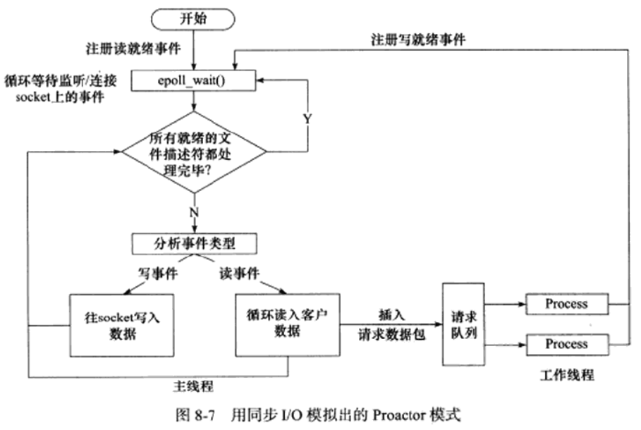
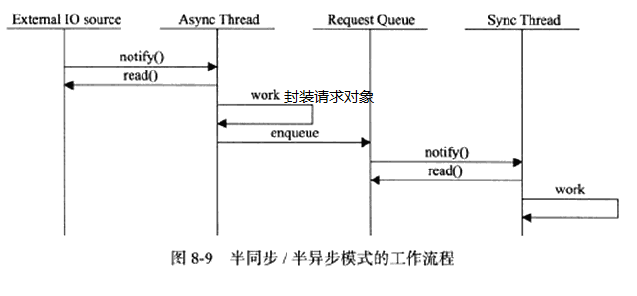
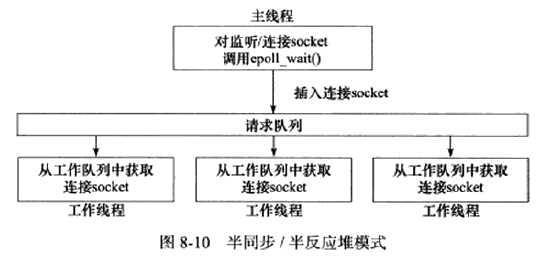
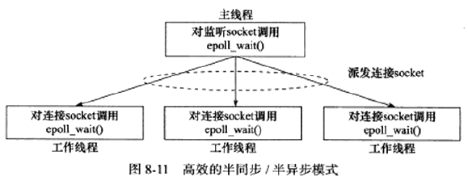
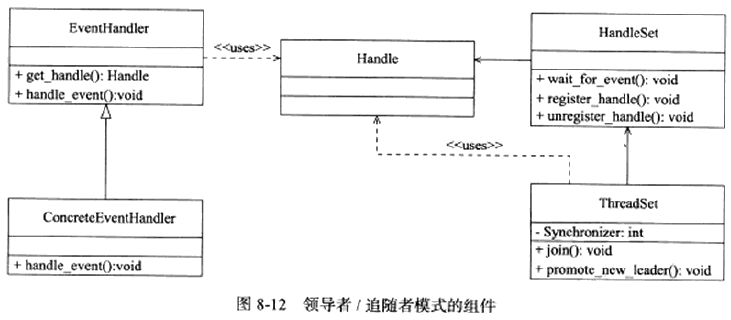
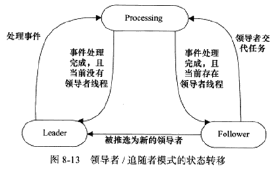
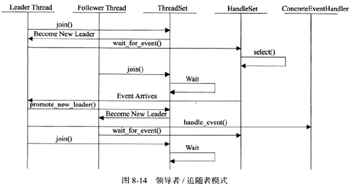

# 第 8 章 高性能服务器程序框架

## 1、服务器模型

### C/S 模型

所有客户端都是通过访问服务器来获取所需的资源。

服务器创建一个或多个监听套接字，调用 bind 绑定服务器感兴趣的端口后调用 listen 等待客户的连接，由于客户调用 connect 进行连接是随机的异步事件，所以服务器需要 I/O 模型来监听（此图使用了 I/O 复用的 select 系统调用），当监听到新的连接，通过 accept 返回监听队列的连接并通过 fork 调用创建子进程来给其分配新的逻辑单元（子进程、子线程或其他方式都可以），在该逻辑单元中处理客户的请求以及返回结果，而父进程继续负责监听其他客户的请求（避免出现必须处理完前一个客户请求才能处理下一个客户请求的串行服务器），同时监听多个请求通过 select 系统调用实现。

**特点：** 

* 资源集中在服务器是通信的中心，实现简单。
* 当访问量过大，可能客户将得到很慢的响应。

### P2P 模型(点对点)

**特点：**

* 在消耗服务的同时也提供服务，即是客户端又是服务端，而不是以服务器为中心。
* 充分、自由的分享资源。（云计算机群）
* 当用户之间请求过多时，网络负载将加重。
* 主机之间很难互相发现，通常带有以专门的发现服务器，提供查找服务使客户尽快找到需要的资源。

## 2、服务器编程框架

以上内容对于一台服务器和服务器机群各部件含义如下：

**I/O 处理单元** 

* 单服务器：等待并接受客户连接，接收客户数据并将服务器响应数据发送给客户
* 服务器机群：作为接入服务器，选择所有逻辑服务器中负荷最小的来服务新客户，实现负载均衡

数据的收发不一定在 I/O 处理单元，也可能直接在逻辑单元中直接就发送了，取决于 **事件处理模式**

**逻辑单元**

* 单服务器：一个逻辑单元对应一个进程或线程，负责分析处理客户数据并将结果通过 I/O 处理单元或直接发送给客户
* 服务器机群：对应的一个逻辑单元就是一个逻辑服务器，其中有多个逻辑单元，能处理多客户任务的并行处理

**网络存储单元：** 可以是数据库、文件和缓存或者一台独立服务器，不是必须，如: ssh、telnet等登陆服务

**请求队列**

* 单服务器：各单元间通信方式的抽象，如 I/O 处理单元接收到客户请求时如何通知逻辑单元处理；多个逻辑单元同时访问一个存储单元时采用某种机制处理竞争条件
* 服务器机群：各服务器间预先建立的、静态的、永久的 TCP 连接，避免动态建立 TCP 连接导致的额外系统开销，提高服务器间交换数据的效率

|     模块     |     单个服务器程序     |                  服务器机群                   |
| :----------: | :--------------------: | :-------------------------------------------: |
| I/O 处理单元 | 处理客户连接、读写数据 |         作为接入服务器，实现负载均衡          |
|   逻辑单元   |     业务进程或线程     |                  逻辑服务器                   |
| 网络存储单元 |   数据库、文件或缓存   |                 数据库服务器                  |
|   请求队列   |    各单元间通信方式    | 各服务器间预先建立的、静态的、永久的 TCP 连接 |

## 3、I/O 模型

**阻塞  I/O：** 执行的系统调用可能会因为无法立即完成而被系统挂起，直到等待的事件发生为止。(socket编程中accept/recv/send/connect都可能被阻塞)

**非阻塞  I/O：** 不管事件是否发生，都立即返回；如果事件没有立即发生，返回-1置 errno 。(accept/recv/send通常为 EAGAIN:再来一次，connect为 EINPROGRESS:在处理中)

在事件发生的情况下操作非阻塞I/O才能提高效率，因此，非阻塞I/O需要搭配I/O通知机制一起使用。

**I/O 复用：** 常用的I/O通知机制。应用程序通过I/O复用函数向内核注册一组事件，内核通过I/O复用函数将其中就绪的事件通知给应用程序；本身是 **阻塞** 的，通过能同时监听多个I/O事件的能力提升效率。(select/poll/epoll_wait)

**SIGIO 信号：** 当目标文件描述符指定了宿主进程，则指定的宿主进程可以捕获SIGIO信号。当文件描述符有事件发生时，SIGIO信号的信号处理函数将被触发，则可在该处理函数中执行非阻塞I/O操作。

|  I/O模型   |                      读写操作和阻塞阶段                      |     其他描述      |
| :--------: | :----------------------------------------------------------: | :---------------: |
|  阻塞I/O   |                        阻塞于读写操作                        |       同步        |
|  I/O 复用  | 阻塞于I/O复用系统调用，但可以同时监听多个I/O事件。对I/O本身的读写是非阻塞的 | I/O通知机制，同步 |
| SIGIO 信号 | 信号触发读写就绪事件则应用程序执行读写操作。程序没有阻塞阶段 | I/O通知机制，同步 |
|  异步I/O   |     内核执行读写操作并触发读写完成事件。程序没有阻塞阶段     |                   |

**同步I/O模型：** 在**事件发生后，应用程序自行**  将数据从内核缓冲区数据读出到用户缓冲区（读过程）或从用户缓冲区写入内核缓冲区（写过程）

**异步I/O模型：** 用户可以直接对I/O执行操作，这些操作会告诉内核用户读写缓冲区的位置，直接由内核接管完成。异步操作的读写操作总是立刻返回，不论I/O是否阻塞

通知的区别：同步I/O模型向应用程序通知的是 **就绪事件** ，异步I/O模型向应用程序通知的是 **完成事件** 

## 4、两种高效的事件处理模式

服务器程序需要处理三种事件：I/O事件、信号和定时器事件。

### Reactor 模式

主线程(I/O处理单元)只负责监听文件描述符上是否有事件发生，当有事件发生则通知工作线程(逻辑单元)处理客户连接、请求和业务。

以同步 I/O 模型(epoll_wait为例)实现流程：

1. 主线程往epoll内核事件表中注册 socket 上的读就绪事件
2. 主线程调用epoll_wait等待读就绪事件
3. 当socket有可读数据，epoll_wait将通知主线程，主线程则将socket可读事件加入请求队列。
4. 请求队列上某个睡眠的工作线程将被唤醒，用于从socket读取数据和处理客户请求，然后往epoll内核事件表中注册该 socket 上的写就绪事件。
5. 当socket可写时，epoll_wait将通知主线程，主线程则将socket可写事件加入请求队列。
6. 请求队列上某个睡眠的工作线程将被唤醒，用于向socket写数据，返回客户请求的结果。

### Proactor 模式

所有的 I/O 操作都交给主线程和内核处理，工作线程只负责业务逻辑。

使用 **异步I/O 模型** (aio_read/aio_write为例)实现流程：

1. 主线程调用aio_read函数向内核注册socket读完成事件，告诉内核用户读缓冲区位置，约定读完成后通知应用程序的方式(信号为例)
2. 主线程继续处理其他逻辑
3. 当socket数据被读入用户缓冲区后，内核将向应用程序发送信号通知数据可用
4. 应用程序预先定义好的信号处理函数将选择一个工作线程来处理客户请求。工作线程处理完客户请求后将调用aio_write函数向内核注册socket写完成事件，告诉内核用户写缓冲区位置，约定写完成后通知应用程序的方式(信号为例)
5. 主线程继续处理其他逻辑
6. 当用户缓冲区数据写入socket后，内核将向应用程序发送信号通知数据已经发送完毕
7. 应用程序预先定义好的信号处理函数将选择一个工作线程做善后处理，如：决定是否关闭socket

由于Proactor 模式对于连接socket的读写事件是通过aio_read/aio_write向内核注册的，内核将通过信号通知应用程序连接socket的读写事件，而主线程中epoll_wait只能检测监听socket上的连接请求事件，不能监听连接socket的读写事件。

**模拟Proactor 模式**

主线程执行数据的读写操作，读写完成后，主线程向工作线程通知这一“完成事件”，工作线程直接获取数据读写的结果，只是对数据结果进行逻辑处理。

使用 **同步I/O模型** 来(epoll_wait为例)实现流程：

1. 主线程往epoll内核事件表中注册socket读就绪事件。
2. 主线程调用epoll_wait等待socket数据可读。
3. 当socket数据可读，epoll_wait通知主线程。主线程从socket中循环读取数据直到没有数据可读为止，然后将读到的数据封装成请求对象并插入请求队列。
4. 请求队列中某个睡眠的工作线程被唤醒，获取该请求对象处理客户请求，然后往epoll内核事件表中注册socket写就绪事件。
5. 主线程调用epoll_wait等待socket数据可写。
6. 当socket数据可写，epoll_wait通知主线程。主线程往socket写入服务器处理客户请求的结果。

## 5、两种高效的并发模式

**并发编程：** 让程序“同时”执行多个任务，针对计算密集型优势不大，因为任务的来回切换使得效率变低；往往提升I/O密集型的程序效率，当程序阻塞于I/O操作时，所在的执行线程可以主动放弃CPU或经系统调度，将执行权转移到其他线程。

**I/O 密集型程序：** 频繁的操作I/O，如：读写文件、访问数据库等，I/O操作的速度肯定没有CPU执行速度快。

**并发编程模式：** 指的是I/O处理单元和多个逻辑单元协调完成任务的方法，主要有 **半同步/半异步模式** 和 **领导者/追随者模式** 两种

### 半同步/半异步模式

区别于之前I/O模型同步的概念，并发编程中概念如下：

同步：完全按照代码顺序执行程序，效率低、实时性差但逻辑简单

异步：程序的执行依靠系统事件（如：信号、中断等）的驱动，效率高、实时性强但编写复杂、难于调试和拓展，不适合大量并发。

**模式的引入：** 结合并发编程中同步和异步编程的特点，为实现既能实时性好又能同时处理多个客户请求的应用程序，我们应同时采用异步和同步线程来实现，半同步/半异步模式。

**流程：** 异步线程处理I/O事件(I/O处理单元)，当监听到有客户请求后，将其封装成请求对象插入请求队列，请求队列将通知同步模式的工作线程来处理该请求对象，具体选择哪个工作线程的方法有轮流选取的Round Robin算法、条件变量和信号量。

根据事件处理模式和I/O模型，半同步/半异步模式存在多种变体，**半同步/半反应堆模型** 就是其中一种。

**半同步/半反应堆模型** 采用 Reactor 事件处理模型。异步线程由主线程充当，用于监听所有 socket 上的事件。当监听socket上有可读事件发生即有新的连接请求，主线程接受且得到新的连接socket，然后往epoll内核事件表注册该连接socket的读写事件，如果该连接socket有读写事件发生，则主线程将该连接socket插入请求队列，当请求队列中所有睡眠的工作线程知道有任务之后，将经过竞争(如申请互斥锁)获得任务的接管权，则 **工作线程连接socket进行读写。**

 **缺点：**

* 主线程和工作线程共享请求队列，则需要对请求队列加锁保护，消耗CPU时间
* 一个工作队列只能处理一个用户请求，当请求过多而工作线程太少时，请求队列将堆积很多任务对象，客户端响应越来越慢；而当增加工作线程时，工作线程间的切换也将消耗CPU时间。

主线程只负责监听socket，连接socket由工作线程管理。当有新的连接到来，主线程接受并返回新的连接socket，将其派发给某个工作线程，该工作线程将处理此连接socket上的所有I/O操作直到客户关闭。

派发的方式是主线程往与某个工作线程的管道中写数据，工作线程检测管道有数据可，分析是否为一个新客户连接到来，如果是，则将该新的连接socket上的读写事件注册到epoll内核事件表中。

**特点：**

* 主线程通过派发socket给工作线程，避免了共享请求队列，减少加锁的CPU消耗
* 每个线程都维持自己的事件循环监听不同的事件，每个线程都工作在异步模式(不是I/O模型的异步！这里是通过事件驱动应用程序！)

### 领导者/追随者模式

多个工作线程轮流获得事件源集合，轮流监听、分发并处理事件的模式。任意时间点，应用程序仅有一个领导者线程，负责监听I/O事件。其他的工作线程都是追随者，休眠在线程池内等待成为新的领导者线程。当领导者线程检测到I/O事件，将会从线程池内推出新的领导线程，然后才去处理I/O事件，新的领导者线程将等待新的I/O事件到来，两者实现并发。

领导者/追随者模式包含组件如下：

**句柄集(HandleSet)**

句柄(Handle)表示I/O资源，通常为一文件描述符。句柄集管理众多的句柄，调用wait_for_event来监听句柄的I/O事件，将其中的就绪事件通知领导者线程。领导者线程调用句柄集中的register_handle将Handle与事件处理器绑定，调用绑该事件处理器来处理事件。

**线程集(ThreadSet)**

该组件是所有线程(领导者线程和追随者线程)的管理者，负责各线程之间的同步和新领导线程的推出。线程集中的线程任一时刻，都将处于以下三种状态之一：

* Leader：线程处于领导者身份，负责监听句柄集的I/O事件。
* Processing：线程正在处理事件。领导者线程检测到I/O事件后，可以转移到Processing状态，并调用promote_new_leader推出新的领导者或指定其他追随者来处理事件(此时领导者身份不变)，当处于Processing状态的线程处理完事件后当前线程集没有领导线程，则它将成为领导者，否则将成为追随者。
* Follwer：线程处于追随者身份，通过调用线程集的join方法等待成为新的领导者，当然，也可能被当前的领导者指定处理任务。

**事件处理器(EventHandle) 和 具体事件处理器(ConcreteEventHandle) **

事件处理器包含一个或多个回调函数handle_event，用于处理事件的业务逻辑。事件处理器使用前需要绑定到某个句柄，当句柄发生事件时，领导者线程就执行与其绑定的事件处理器中的回调函数。

具体事件处理器是事件处理器的子类，需要重写基类的handle_event用于处理特定任务。

**优劣：**

* 领导者线程自行监听I/O事件，不需要在线程间传递额外的数据，也不需要在线程间同步对请求队列的访问
* 仅支持一个事件源集合，无法像图11那样让工作线程独立管理多个客户连接。

