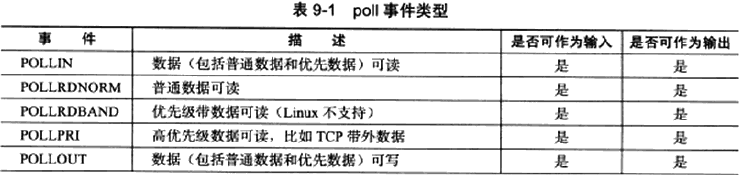
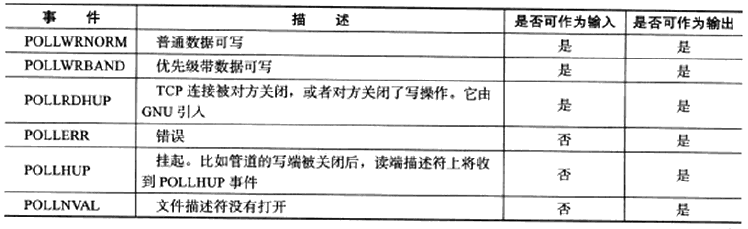
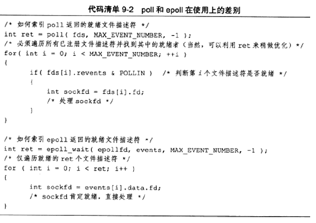

# 第 9 章 I/O 复用

 I/O 复用能使程序同时监听多个文件描述符，大大提高程序性能。使用 I/O 复用有如下常用场景：

* 客户端要同时处理多个 socket
* 客户端要同时处理用户输入和网络连接，如聊天程序
* TCP 服务器要同时处理监听 socket 和连接 socket，这是最常见的场景
* 服务器要同时处理 TCP 请求和 UDP请求，如回射服务器
* 服务器要监听多个端口处理多种服务

I/O 复用虽然能监听多个文件描述符，但其本身还是阻塞的，且如果当多个文件描述符同时就绪，若没有采取多进程或多线程等编程手段，则程序只能按照顺序依次处理每个文件描述符。Linux 下实现 I/O 复用的系统调用有 select/poll/epoll。


# 1、select 系统调用

在一段时间内，监听用户感兴趣的文件描述符上的可读、可写和异常事件。

```C++
#include <sys/select.h>

/**
	fd_set结构体仅包含一个整形数组，每个元素的每一位标记一个文件描述符，
	fd_set容纳文件描述符数量由 FD_SETSIZE 指定(通常1024)，则指定了select能处理的文件描述符总量。
	位操作过于繁琐，使用以下宏来访问fd_set结构体中的位
*/
FD_ZERO(fd_set* fd_set);//清除fd_set所有位
FD_SET(int fd, fd_set* fd_set);//设置fd_set的位fd
FD_CLR(int fd, fd_set* fd_set);//清除fd_set的位fd
int FD_ISSET(int fd, fd_set* fd_set);//判断fd_set的位fd是否被设置

struct timeval
{
    long tv_sec;//秒
    long tv_usec;//微秒
};
/**
描述：
	客户将感兴趣的文件描述符传入对应的文件描述符集合(readfds/writefds/exceptfds),
	select调用返回时，内核将修改对应的集合以通知客户哪些文件描述符已就绪
	timeval结构体指针，在成功返回时会告诉应用程序select等待了多久
返回值：
	成功返回就绪(可读、可写和异常)文件描述符的总数
	0：超时时间内没有任何文件描述符就绪
	-1并置errno:失败或者在select等待期间收到信号(errno置EINTR)
*/
int select(int nfds,//被监听文件描述符的总数，通常为所有文件描述符最大值加1，因为是从0开始计数 
           fd_set* readfds,//指向可读事件文件描述符集合
           fd_set* writefds,//指向可写事件文件描述符集合
           fd_set* exceptfds,//指向异常事件文件描述符集合
           struct timeval* timeout//超时时间设置 0：立刻返回, NULL: 阻塞直到某个文件描述符就绪
          );
```


### 文件描述符就绪条件

对于select使用，需要知道文件描述符哪些情况被认为可读、可写或出现异常。网络编程中，

**socket 可读：**

* socket 内核的接收缓存区中字节数大于其低水位标记 SO_RCVLOWAT，此时可以无阻塞的读该 socket
* socket 通信对方关闭连接，则对该 socket 的读操作返回0
* socket 上有未处理的错误，可以使用 getsockopt 来读取和清除该错误。

**socket 可写：**

* socket 内核的发送缓存区中字节数大于或等于其低水位标记 SO_SNDLOWAT，此时可以无阻塞的写该 socket
* 对写操作被关闭的 socket 执行写操作将被触发 SIGPIPE 信号
* socket 使用非阻塞 connect 成功或失败(超时)之后
* socket 上有未处理的错误，可以使用 getsockopt 来读取和清除该错误。

**socket 处理异常：**

* socket 接收到带外数据，对于异常事件，采用带 MSG_OOB 标志的 recv 函数读取带外数据


## 2、poll 系统调用

与 select 类似，在指定时间内轮询一定数量的文件描述符，测试其中是否有就绪者。

```C++
#include <poll.h>

struct pollfd
{
    int fd;//文件描述符
    short events;//注册的事件，即告诉poll监听fd上的哪些事件，一系列事件的按位或
    short revents;//实际发生的事件，由内核填充
};

/**
描述：
	fds:结构体数组，指定感兴趣的文件描述符上发生的事件
	nfds:无符号长整型，指定被监听事件集合fds的大小,即最多监听多少事件
	timeout:超时值，毫秒为单位。
		-1: poll将阻塞直到某事件发生
		0:poll立即返回
返回值：
	与select一致
*/
int poll(struct pollfd* fds, nfds_t nfds, int timeout);
```






## 3、epoll 系统调用

Linux 中特有的 I/O 复用函数，与select和poll只使用单个函数不同，epoll使用一组函数来完成I/O复用任务。epoll 将用户关心的文件描述符上的事件放在内核中的事件表中，因此无需重复的传入文件描述符集和事件集，但epoll需要使用一个额外的文件描述符用来标识内核中的这个事件表。

```C++
#include <sys/epoll.h>
/**
描述:
	size:给内核的一个提示，告诉它事件表需要多大
返回值:
	返回指向内核事件表的文件描述符，用作后续epoll函数调用的第一个参数
*/
int epoll_create(int size);


typedef union epoll_data
{
    void* ptr;//用户数据
    int fd;//该事件所从属的文件描述符
    uint32_t u32;
    uint64_t u64;
}epoll_data_t;

struct epoll_event
{
    __uint32_t events;//epoll事件
    epoll_data_t data;//用户数据
};

/**
描述:
	epfd:指向内核事件表的文件描述符
	fd:需要操作的文件描述符
	op:指定操作类型
		EPOLL_CRL_ADD:往事件表中注册fd上的事件
		EPOLL_CRL_MOD:修改fd上的注册事件
		EPOLL_CRL_DEL:删除fd上的注册事件
	event:指定事件，支持的事件和poll基本相同，在对应宏前面加"E"，额外事件(EPOLLET/EPOLLONESHOT)
返回：
	成功 0，失败 -1 置errno
*/
int epoll_ctl(int epfd, int op, int fd, struct epoll_event* event);

/**
描述:
	在一段超时时间内等待一组文件描述符上的事件
	timeout:与poll一致
	maxevents：最多监听多少事件
	events：当epoll_wait监听到事件，从内核事件表中复制所有就绪的事件到该结构体数组
	epfd：内核事件表对应的文件描述符
返回：
	成功返回就绪的文件描述符个数，失败返回 -1 置errno
*/
int epoll_wait(int epfd, struct epoll_event* events, int maxevents, int timeout);
```




### LT 和 ET 模式

**LT (Level Trigger，电平触发)：** epoll_wait 检测到有事件发生将通知应用程序，应用程序可以不立刻该事件，则下擦调用 epoll_wait 还会向应用程序通告此事件，直到事件被处理，相当于效率较高的poll。

**ET (Edge Trigger，边沿触发)：** epoll_wait 检测到有事件通知应用程序，应用程序必须立即处理该事件，因为后续 epoll_wait 将不再向应用程序通知这一事件，因此，**处于 ET 模式的文件描述符需要是非阻塞的**，不然没有后续事件的到来就会一直处于阻塞状态（饥渴状态）。epoll 的高效工作模式。

实现：往 epoll 内核事件表中注册一个文件描述符上的 EPOLLET 事件，则epoll将以ET模式来操作该文件描述符。

体现：如在读数据时，LT 模式可以不用一次将接受缓存区的数据都读完可以分几次，因为只要有数据就一直处于事件就绪状态；而 ET 模式，则需要在一次事件到来时将这些数据都读出来，因为没有反复的事件告诉应用程序缓存区还有数据。


