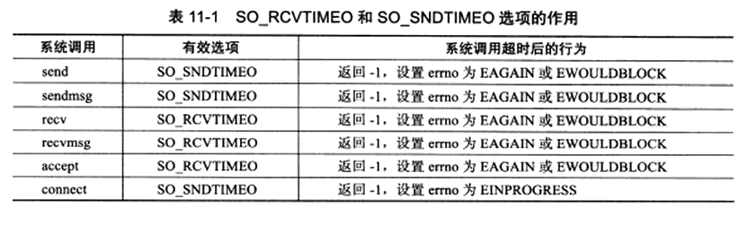

# 第 11 章 定时器

服务器程序需要处理三种事件：**I/O事件、信号和定时器事件。**

服务器程序管理众多的定时器事件，因此，需要有效的组织这些定时器事件能在预期的时间点被触发且不影响服务器的主要逻辑：将每个事件封装成定时器，并使用容器类数据结构进行管理，如：**时间轮和时间堆** 

**定时** 是指在一段时间之后触发某段代码的机制，Linux 提供如下定时方法：

* socket 选项 SO_RCVTIMEO 和 SO_SNDTIMEO
* SIGALRM 信号
* I/O 复用系统调用的超时参数

## 1、socket 选项 SO_RCVTIMEO 和 SO_SNDTIMEO

SO_RCVTIMEO 和 SO_SNDTIMEO 选项用来设置 socket 接收数据超时时间和发送数据超时时间，仅对数据接收和发送相关的 socket 专用系统调用有效。

## 2、SIGALRM 信号

由 alarm 和 setitimer 函数设置的实时闹钟一旦超时，将触发 SIGALRM 信号，利用其信号处理函数来处理定时任务。

## 

