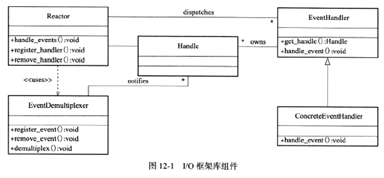
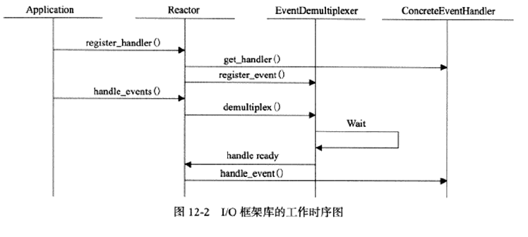

# 第 12 章 高性能 I/O 框架库 Libevent

Linux 服务器程序在处理 I/O 事件、信号和定时器事件时往往需要考虑以下三个问题：**统一事件源、可移植性 以及 对并发编程的支持。**

Libevent：开源的 I/O 框架库，解决以上三个考虑，是开发者着重于逻辑的开发。

## 1、I/O 框架库概述

**描述：** I/O 框架库以库函数的形势封装底层的系统调用，给应用程序提供一组更便于使用的接口。

**实现：** 各 I/O 框架库的实现原理基本相似，基于 Reactor 模式、Proactor模式或同时以两种模式实现。以 Reactor 模式为例需要包含几大组件：句柄、事件处理器、具体事件处理器、事件多路分发器和 Reactor 。

### 句柄

I/O 事件、信号及定时器事件是 I/O 框架库要处理的对象，即事件源。每一事件源与一个句柄相绑定，当内核检测到事件发生，是**通过句柄来通知应用程序事件的发生。** Linux下，I/O 事件对应的句柄就是文件描述符、信号事件对应的句柄则是信号值。

### 事件多路分发器

**事件循环：** 由于事件的到来时一异步的、随机的，所以程序需要循环的等待并处理事件。

**事件多路分发器：** 事件循环中，等待事件一般使用 I/O 复用技术来实现，I/O框架库将系统支持的各种 I/O 复用系统调用封装成统一的接口，即事件多路分发器。此外，还应该支持网事件多路分发器中添加事件和从中删除事件。

demultiplex 内部调用 select、poll、epoll_wait等函数，是等待事件的核心函数。

### 事件处理器和具体事件处理器

事件处理器执行事件对应的业务逻辑，通常包含一个或多个handle_event回调函数，一般在事件循环中被执行。在 I/O 框架库中，事件处理器通常是一接口，用户需要继承它来实现自己的具体时间处理器。

事件多路分发器检测有事件发生时，通过句柄通知应用程序，所以需要将事件处理器和句柄绑定才能在事件发生时获得正确的事件处理器。get_handle 返回该事件处理器关联的句柄。

### Reactor

I/O 框架库的核心，提供如下方法：

handdle_events：执行事件循环，重复如下过程：等待事件、依次处理所有就绪事件对应的事件处理器。

register_handler：调用事件多路分发器 register_event 方法往事件多路分发器中注册一个事件。

remove_handler：调用事件多路分发器 remove_event 方法往事件多路分发器中删除一个事件。

**补充：**

1. 事件指的是某一个句柄上绑定的事件，如：文件描述符0上的可读事件
2. 事件处理器，为一 event 结构体类型的对象，包含句柄和事件类型两个必备要素外，还可包含如：回调函数等其他成员
3. 事件由事件多路分发器管理，事件处理器由事件队列管理：event_base 中注册事件队列、活动事件队列和通用定时器队列和 evmap 中 I/O 事件队列、信号事件队列
4. 事件循环中对一个就绪事件的处理，指该事件对应的事件处理器中的回调函数

0. 0 创建 Reactor 实例。

0. 1 创建具体事件处理器。设置所从属的 Reactor 实例、指定与该事件处理器关联的句柄(I/O事件处理器时为文件描述符，信号事件处理器时为信号值，定时时间处理器 -1)，指定事件类型和目标事件对应的回调函数。
1. 应用程序调用 Reactor 实例的 register_handler 方法。
2. Reactor 实例先通过 get_handler 获取具体事件处理器关联的句柄。
3. Reactor 实例将该句柄对应的事件添加到事件多路分发器，并将事件处理器添加到注册事件队列中。
4. 应用程序调用 Reactor 实例的 handdle_events 方法，本质是使用事件多路分发器的 I/O 复用方法 demultiplex 监听、等待事件发生。
5. 事件多路分发器检测有事件发生时，通过句柄通知 Reactor 实例。
6. Reactor 实例调用该句柄关联的具体事件处理器中的回调函数。

