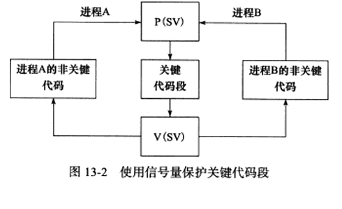
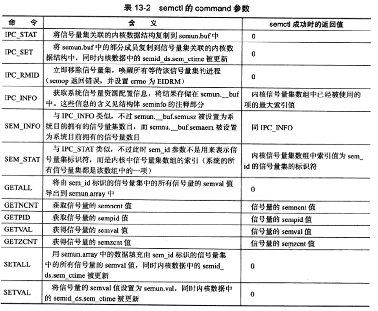
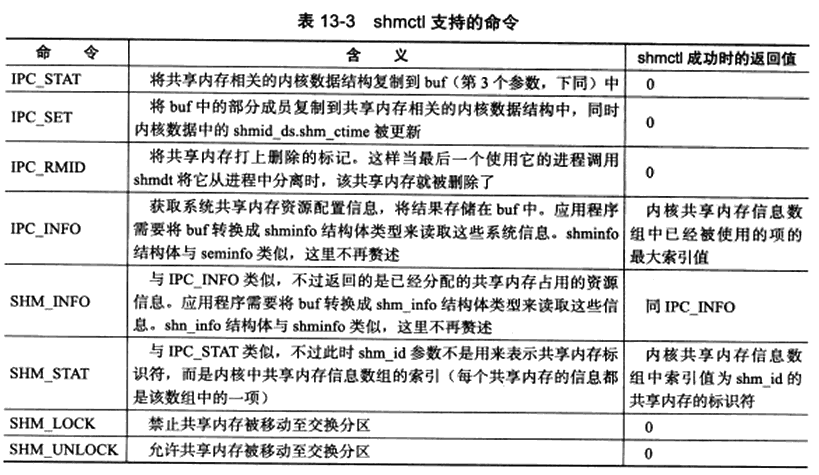
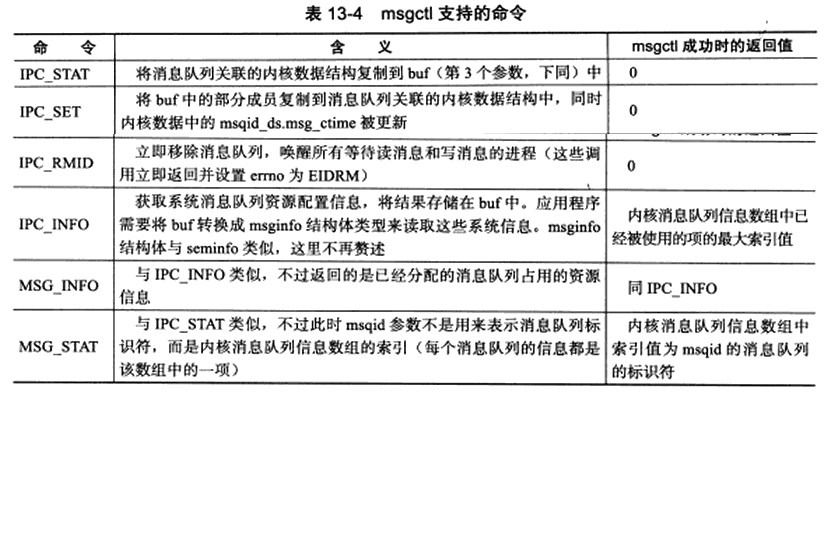

# 第 13 章 多进程编程

将对如下内容进行讨论：

* fork 系统调用(复制进程映像)和 exec 系列系统调用(替换进程映像)
* 僵尸进程和如何避免僵尸进程
* 进程间通信(IPC)最简单方式：管道
* System V 进程间通信方式：信号量、消息队列和共享内存
* 进程间传递文件描述符的通用办法：通过 UNIX 本地域 socket 传递特殊辅助数据


## 1、fork 系统调用

``` C++
#include <sys/types.h>
#include <unistd.h>
/**
	Linux创建新进程
	成功调动将有两次返回，父进程中返回子进程PID，子进程中返回0，用于判断父子进程
	失败 -1，置 errno
*/
pid_t fork(void);
```

fork 函数复制当前进程，在内核中创建一新的进程表项，其中很多属性如：堆指针、栈指针和标志寄存器的值都与原进程相同。因此，子进程代码与父进程完全相同，也会采取“写时复制”的方式复制父进程的数据（堆数据、栈数据和静态数据），但子进程的一些属性：如 PPID 将是原进程的 PID、信号位图被清除即原进程的信号处理函数对新的子进程不起作用。

**写时复制：** 任一进程（父进程或子进程）对数据执行了写操作，复制才会发生（先是缺页中断，然后操作系统给子进程分配内存并复制父进程的数据）。所以如果在程序中分配了大量内存，使用 fork 应谨慎使用避免不必要的内存分配和数据复制。

对于在父进程中打开的文件描述符，在子进程中也是打开的，文件描述符的引用计数加 1。父进程的用户根目录、当前工作目录等变量的引用计数均会加 1。


## 2、exec 系统调用

```C++
#include <unistd.h>
extern char** environ;

/**
	替换当前进程映像，执行其他程序
	path:指定可执行文件的完整路径
	file:接收文件名，具体位置在环境变量 PATH 中搜寻
	arg:可变参数，被传递给新程序的main函数
	argv:参数数组，被传递给新程序的main函数
	envp:设置新程序的环境变量，如果未设置，则使用全局变量environ指定的环境
	
	失败 -1，置errno
	成功则一般不返回，直接执行新程序去了，原程序exec调用后的代码不再执行，被exec参数指定的程序完全替换
	exec 函数不会关闭原程序打开的文件描述符，除非该文件描述符设置了 SOCK_CLOEXEC 类似的属性
*/
int execl(const char* path, const char* arg, ...);
int execlp(const char* file, const char* arg, ...);
int execle(const char* path, const char* arg, ..., char* const envp[]);
int execv(const char* path, char* const argv[]);
int execl(const char* file, char* const argv[]);
int execl(const char* path, char* const argv[], char* const envp[]);
```


## 3、处理僵尸进程

多进程程序中，父进程将会对子进程的退出状态进行跟踪。因此，子进程结束后内核不会立马释放掉该进程的进程表表项，以满足父进程后续对子进程退出信息的查询。

**子进程僵尸态：**

1. 子进程结束运行之后，父进程读取其退出状态之前
2. 父进程结束或异常退出，而子进程继续运行。此时子进程的 PPID 将被操作系统设置为 1，即 init 进程接管该子进程，并等待它结束。

父进程没有正确处理子进程的返回信息，子进程都将停留在僵尸态，占据内核资源。所以为了避免僵尸进程的产生，需要在父进程中等待子进程的结束并获取子进程的返回信息。

```C++
#include <sys/types.h>
#include <sys/wait.h>

/**
描述：
	阻塞进程，直到该进程的某个子进程结束运行
返回：
	返回子进程的 PID ，将子进程退出状态信息存储于stat_loc参数指向的内存
*/
pid_t wait(int* stat_loc);

/**
描述：
	等待pid参数指定的子进程；pid = -1 时与wait相同，等待任意一个子进程结束
	stat_loc：存储子进程退出状态信息的内存
	options：控制waitpid行为。为WNOHANG时，waitpid将是非阻塞的
返回：
	pid指定的目标子进程没有结束或意外终止，返回0
	子进程正常退出，返回子进程PID
	失败 -1，置 errno
*/
pid_t waitpid(pid_t pid, int* stat_loc, int options);
```

sys/wait.h 头文件中用于解释子进程退出状态信息的宏：

|          宏           |                      含义                       |
| :-------------------: | :---------------------------------------------: |
|  WIFEXITED(stat_val)  |          如果子进程正常结束，返回非0值          |
| WEXITSTATUS(stat_val) |      如果WIFEXITED非0，返回子进程的退出码       |
| WIFSIGNALED(stat_val) | 如果子进程因为一个未捕获的信号而终止，返回非0值 |
|  WTERMSIG(stat_val)   |       如果WIFSIGNALED非0，返回一个信号值        |
| WIFSTOPPED(stat_val)  |          如果子进程意外终止，返回非0值          |
|  WSTOPSIG(stat_val)   |        如果WIFSTOPPED非0，返回一个信号值        |

**利用 SIGCHLD 信号高效使用：** 当子进程退出后，将给父进程发送一个 SIGCHLD 信号，这使得我们可以在“事件已发生的情况下，执行非阻塞调用提高程序效率”；即在该信号的信号处理函数内非阻塞的使用 waitpid 系统调用。


## 4、管道

### 无名管道 pipe

管道能在父、子进程间传递数据，因为 fork 调用之后两个管道文件描述符都保持打开。使用 pipe 只能保证父、子进程间一个方向的数据传输，如果需要双向数据传输，则需要使用两个管道或使用 socketpair 系统调用创建全双工管道。

缺点：无名管道只能在父、子进程间创建通信，而无关联的进程则不行。


### 命名管道 FIFO

可以在无关联的进程间建立通信管道。


## 5、System V IPC（进程间通信）：信号量

**进程同步引入背景：** 多进程同时访问系统某一个资源，如：同时写一个数据库的某条记录或同时修改某文件，需要考虑进程的同步问题，确保任一时刻只有一个进程可以拥有对资源的独占式访问。

**临界区：** 对共享资源进行访问的很短的一段代码，关键代码段。

**信号量概念：** 一种特殊的变量，只能取自然数值并只支持 P（进入临界区）和 V（退出临界区）两种操作。



假设信号量 SV（一般取二进制信号量0/1），执行P、V操作含义如下：

* P（SV）：如果 SV 的值大于0，则减 1；如果 SV 的值等于0，则挂起进程的执行
* V（SV）：如果有其他进程因为等待 SV 而挂起，则唤醒；如果没有，将 SV 加1。

如图：

* 信号量 SV 的值为1，临界区（关键代码段）可用，如果此时进程 A 执行P（SV），则 A 进入临界区，SV 为 0。
* 当进程 B 想进入临界区时，发现 SV 为 0，则被挂起。
*   进程 A 离开临界区，执行 V（SV），SV 为 1，临界区重新可用，处于挂起状态的进程 B 被唤醒执行 P（SV）进入临界区。
* 如果此时进程 A在执行 P（SV），将被操作系统挂起等待 B 退出临界区。


#### semget 系统调用

```C++
#include <sys/sem.h>

/**
描述：
	创建一个新的信号量集或获取一个已经存在的信号量集
	key：键值，标识全局唯一的信号量集，如文件名全局唯一标识一个文件。通过信号量通信的进程需要使用相同的键值创建/获取该信号量。
	num_sems：信号量集的中信号量的数目。创建信号量时需要指定，如获取已经存在的信号量可以置为0。
	sem_flags：一组标志，低9bit为该信号量的权限。与open参数mode相同
	
返回值：
	成功返回正整数值表示信号量集的标识符;失败-1，置errno
*/
int semget(key_t key, int num_sems, int sem_flags);


```

semget 用于创建信号量集时，与之关联的内核数据结构体 semid_ds 将被创建并初始化

```C++
#include <sys/sem.h>
//用于描述 IPC对象（信号量、共享内存和消息队列）的权限
struct ipc_perm
{
    key_t key;//键值
    uid_t uid;//所有者的有效用户ID
    gid_t gid;//所有者的有效组ID
    uid_t cuid;//创建者的有效用户ID
    gid_t cgid;//创建者的有效用户ID
    mode_t mode;//访问权限
    ...
};

struct semid_ds
{
    struct ipc_perm sem_perm;//信号量的操作权限
    unsigned long int sem_nsems;//该信号量集中的信号量的数目
    time_t sem_otime;//最后一次调用semop的时间
    time_t sem_ctime;//最后一次调用semctl的时间
    ...
};
```

初始化内容包括：

1. 将 sem_perm.cuid 和 sem_perm.uid 设置为调用进程的有效用户ID

2. 将 sem_perm.cgid 和 sem_perm.gid 设置为调用进程的有效组ID

3. 将 sem_perm.mode 最低9位设置为 sem_flags 参数的最低9位

4. 将sem_otime设置为0

5. 将sem_ctime设置为当前系统时间


#### semop 系统调用

```C++
#include <sys/sem.h>
///涉及的一些内核变量
unsigned short semval;//信号量的值
unsigned short semzcnt;//等待信号量变为0的进程数量
unsigned short semncnt;//等待信号量增加的进程数量
pid_t sempid;//最后一次执行semop操作的进程ID

struct sembuf
{
    unsigned short int sem_num;//信号量集中信号量的编号，从0开始
    short int sem_op;//操作类型，可选正整数、0和负整数，操作行为受sem_flg影响
    short int sem_flg;//IPC_NOWAIT:无论信号量操作成功与否，立刻返回
    				  //SEM_UNDO：当进程退出时取消正在进行的semop操作，见下文
};

/**
描述：
	改变信号量的值，即P/V操作
	sem_id：semget返回的信号量集标识符，用以指定被操作的目标信号量集
	semops：指向sembuf结构体的数组指针
	um_sem_ops：指定要执行的操作个数，即semops数组中元素的个数
	
	semop对semops数组中每个成员按照数组顺序依次进行原子操作，避免别的进程在同一时刻按照不同顺序对信号集中的信号量执行操作导致竞态条件
	
返回值：
	成功0；失败 -1，置 errno，失败时semops数组中指定的所有操作不被执行
*/
int semop(int sem_id, struct sembuf* semops, size_t um_sem_ops);
```

**sem_flg 对 sem_op操作类型的影响：**

| sem_op 值 |               前提               |        信号量的值        | 作用                                                         | sem_flg 标志影响                                             |
| :-------: | :------------------------------: | :----------------------: | :----------------------------------------------------------- | ------------------------------------------------------------ |
|  正整数   | 需要进程有对操作信号量集的写权限 |           不限           | 将操作的信号量值增加 sem_op。                                | 若sem_flg = SEM_UNDO，系统将更新进程的 semadj 变量（用于跟踪进程对信号量的修改情况）。 |
|     0     | 需要进程有对操作信号量集的读权限 |       区分是否为0        | 等待“0”操作。<br />信号量值为0，则立即成功返回；不为0，则返回失败或阻塞进程等待信号量变为0。 | 当semval ！= 0时：<br />if 设置 IPC_NOWAIT 标志，则立刻返回错误置 errno 为 EAGAIN<br />else 信号量的 semzcnt 值加1，进程睡眠直到发生以下条件之一：<br />1、信号量的值semval变为0，此时系统将信号量的semzcnt减1；<br />2、被操作信号量所在的信号量集被进程移除，此时semop调用返回失败置 errno 为 EIDRM；<br />3、调用被信号中断，semop调用返回失败置 errno 为 EINTR，同时该信号量的semzcnt减1。 |
|  负整数   | 需要进程有对操作信号量集的写权限 | 需要与sem_op的值比较大小 | 表示对信号量进行减操作，即期望获得信号量。<br />if(semval >= \|sem_op\|)，<br />则semop操作成功，调用进程立即获得信号量，系统将该信号量的semval值减去sem_op的绝对值。<br />else <br />返回失败或者阻塞进程以等待信号量可用。 | if(semval >= \|em_op\|)<br />如果设置了SEM_UNDO标志，则系统将更新进程的semadj变量<br />else <br />设置 IPC_NOWAIT 标志，则立刻返回错误置 errno 为 EAGAIN；如未设置，则信号量的 semncnt 值加1，进程睡眠直到发生以下条件之一：<br />1、信号量的值 semval 变得大于或等于 sem_op的绝对值，此时系统将该信号量的 semncnt 值减1，并将semval减去sem_op的绝对值，同时，如果 SEM_UNDO 标志被设置，则系统更新semadj变量<br />2、被操作信号量所在的信号量集被进程移除，此时semop调用返回失败置 errno 为 EIDRM；<br />3、调用被信号中断，semop调用返回失败置 errno 为 EINTR，同时该信号量的semncnt 减1。 |


#### semctl 系统调用

```C++
#include <sys/sem.h>

/**
描述：
	调用者对信号量的直接控制
	sem_id：semget的返回值，用以指定被操作的信号量集
	sem_num：指定信号量集中的第几个信号量
	command：指定要执行的命令
	第4参数为用户自定义参数，sys.sem.h中给出推荐格式，如下
返回值：
	成功返回值取决于command，失败 -1，置errno
*/
int semctl(int sem_id, int sem_num, int command, ...);

//自定义参数
struct seminfo
{
    int semmap;
    int semmni;//系统最多可拥有的信号量集数目
    int semmns;//系统最多可拥有的信号量数目
    int semmnu;
    int semmsl;//一个信号量集最多可拥有的信号量数目
    int semopm;//semop一次能执行sem_op的操作数目
    int semume;
    int semusz;//sem_undo结构体的大小
    int semvmx;//最大允许信号量的值
    int semaem;//最多允许带 SEM_UNFO 标志的 semop 操作次数
};
union semun
{
    int val;//用于SETVAL
    struct semif_ds* buf;//用于IPC_STAT和IPC_SET命令
    unsigned short* array;//用于GETALL SETALL命令
    struct seminfo* __buf;//用于IPC_INFO命令
};
```



**注意：** GETNCNT、  GETPID、GETVAL、GETZCNT和SETVAL操作的是单个信号量，它是由标识符sem_id指定的信号量集中的第sem_num个信号量;而其他操作针对的是整个信号量集，此时semctl的参数sem_num被忽略。


#### 特殊键值 IPC_PRIVATE

semget 调用者可以给 key 传递一个特殊键值 IPC_PRIVATE(值为0)，表明无论该信号量是否存在，semget 都将创建一个新的信号量，对于访问来说，并非像名字一样，其他的进程是可以访问的。 


## 6、System V IPC：共享内存

最高效的 IPC 机制，不涉及进程间任何数据的传输，但为了避免竞态条件需要辅助手段同步进程对共享内存的访问，一般与其他 IPC 方式一起使用。


### shmget 系统调用

```C++
#include <sys/shm.h>

/**
描述：
	创建一端新的共享内存或获取已存在的共享内存
	key：键值，用来标识一段全局唯一的共享内存
	size：共享内存大小，创建时必须指定；获取可为0
	shmflg：低9位表示权限，与 semget一致，额外的：
		SHM_HUGETLB:与mmap的MAP_HUGETLB一致，系统使用大页面来分配共享内存空间
		SHM_NORESERVE:与mmap的MAP_NORESERVE一致，不为共享内存保留交换分区，当物理空间不足时，对该共享内存执行写操作将触发 SIGSEGV 信号
返回值：
*/
int shmget(key_t key, size_t size, int shmflg);
```

创建共享内存后，该共享内存的所有字节初始化为0，与之关联的内核数据结构 shmid_ds 将被创建并初始化

```C++
struct shmid_ds
{
    struct ipe_perm shm_perm; //共享内存的操作权限
 	size_t shm_segsz;   //共享内存大小，单位是字节
 	__time_t shm_atime; //对这段内存最后一次调用shmat的时间
	__time_t shm_dtime; //对这段内存最后一次调用shmdt的时间
 	__time_t shm_ctime; //对这段内存最后一次调用shmct1的时间
    pid_t shm_cpid; //创建者的PID
 	pid_t shm_lpid; //最后一次执行shmat或shmdt操作的进程的PID
 	shmatt_t shm_nattach; //目前关联到此共享内存的进程数量
    ...
};
```

**shmget 对 shmid_ds结构体的初始化包括:**

1. 将shm_perm.cuid和 shm_perm.uid设置为调用进程的有效用户ID。
2. 将shm_perm.cgid和 shm_perm.gid 设置为调用进程的有效组ID。
3. 将shm_perm.mode 的最低 9 位设置为 shmlg 参数的最低9位。
4. 将shm_segsz 设置为 size
5. 将shm_lpid、shm_nattach、shm_atime、shm_dtime 设置为0。
6. 将shm_ctime 设置为当前的时间。


### shmat 和 shmdt 系统调用

共享内存被创建/获取之后，不能立即访问它，而是需要将它关联到进程的地址空间中。使用完后，也需要从进程地址空间中分离。

```C++
#include <sys/shm.h>
/**
描述：
	将共享内存关联到进程的地址空间中
	shm_id:shmget系统调用返回的共享内存标识符
	shm_addr：指定将共享内存关联到进程的哪块空间，还会受shmflg的SHM_RND标志影响
	shmflg：标志值
返回值：
	成功返回共享内存被关联的地址，并修改内核数据结构 shmid_ds 部分字段：
		将shm_nattach加1。
		将shm_lpid 设置为调用进程的PID。
		将shm_atime 设置为当前的时间。
	失败返回(void*)-1,置 errno
*/
void* shmat(int shm_id, const void* shm_addr, int shmflg);
/**
描述：
	将共享内存从进程地址空间中分离
返回值：
	成功返回0，并修改内核数据结构 shmid_ds 部分字段：
		将shm_nattach减1.
		将shm_lpid设置为调用进程的PID。
		将shm_dtime设置为当前的时间。
	失败 -1，置 errno
*/
int shmdt(const void* shm_addr);
```


**shmflg的SHM_RND标志对关联地址的影响：**

1. 如果shm_addr为NULL，则被关联的地址由操作系统选择。这是推荐的做法，以确保代码的可移植性。
2. 如果shm_addr 非空，并且SHM_RND 标志未被设置，则共享内存被关联到 shm_addr 指定的地址处。
3. 如果shm_addr 非空，并且设置了SHM_RND 标志，则被关联的地址是 [shm_addr-(shm_addr % SHMLBA)]。SHMLBA的含义是“段低端边界地址倍数”(Segment Low Boundary Address Multiple)，它必须是内存页面大小(PAGE_SIZE)的整数倍。现在的Linux内核中，它等于一个内存页大小。SHM_RND的含义是圆整(round)，即将共享内存被关联的地址向下圆整到离shm_addr 最近的 SHMLBA 的整数倍地址处。

**shmflg 其他标志：**

* SHM_RDONLY：进程仅能读取共享内存中的内容。若没有指定该标志，则进程可同时对共享内存进行读写操作(当然，这需要在创建共享内存的时候指定其读写权限)。 
* SHM_REMAP：如果地址 shm_addr 已经被关联到一段共享内存上，则重新关联。
* SHM_EXEC：指定对共享内存段的执行权限，实际和读权限一样。


### shmctl 系统调用

```C++
#include <sys/shm.h>

/**
描述：
	控制共享内存的属性
	shm_id：shmget返回的共享内存标识符
	command：要执行的命令
返回值：
	返回值取决于command参数；失败 -1，置errno
*/
int shmctl(int shm_id, int command, struct shmid_ds* buf);
```




### 共享内存的 POSIX 方法

可以利用在高级函数 mmap 的 MAP_ANONYMOUS 标志实现父、子进程间的匿名内存共享。通过打开同一个文件也可实现无关进程间的内存共享。

Linux 提供另一种利用 mmap 无关进程间共享内存的方式，无需任何文件的支持。

使用 POSIX共享内存函数，则编译的时候需要指定链接选项 -lrt 。

```C++
#include <sys/mman.h>
#include <sys/stat.h>
#include <fcntl.h>

/**
描述：
	创建或打开一个 POSIX 共享内存对象，与open系统调用完全相同。
	name：指定要创建/打开的共享内存对象，从可移植性的角度考虑，该参数以“/”开始，后接多个字符，且这些字符都不是“/”;以“\0”结尾，长度不超过NAME_MAX(通常是255)。
	oflag：下列标志中的一个或者多个的按位或
		OCREAT：如果共享内存对象不存在，则创建。此时mode参数的最低9位将指定该共享内存对象的访问权限。共享内存对象被创建的时候，其				  初始长度为0。
		OEXCL：O_CREAT一起使用，如果由name指定的共享内存对象已经存在，则 shm_open调用返回错误，否则就创建一个新的共享内存对				  象。
		O_TRUNC：如果共享内存对象已经存在，则把它截断，使其长度为0
返回值：
	成功返回一文件描述符，用于后续 mmap 调用
	失败-1，置 errno
*/
int shm_open(const char* name, int oflag, mode_t mode);

/**
	该函数将name参数指定的共享内存对象标记为等待删除。当所有使用该共享内存对象的进程都使用munmap将它从进程中分离之后，系统将销毁这个共享内存对象所占据的资源。
*/
int shm_unlink(const char* name);
```

 

## 7、System V IPC：消息队列

消息队列是两个进程间传递二进制块数据的一种简单有效方式，每个数据块有一个特定的类型，接收方可以根据类型来有选择的接收数据，而不是像管道那样必须先进先出的接收数据。

```C++
#include <sys/msg.h>

/**
描述：

返回值：

*/
//涉及的内核数据结构
struct msqid_ds
{
    struct ipc_perm msg_perm; //*消息队列的操作权限*/
	time_t msg_stime; //最后一次调用msgsnd的时间
	time_t msg_rtime; //最后一次调用msgrcv的时间
	time_t msg_ctime; //最后一次被修改的时间*/
	unsigned 1ong __msg_cbytes;//消息队列中已有的字节数
	msgqnum_t msg_gnum; //*消息队列中已有的消息数*
    msglen_t msg_qbytes; //消息队列允许的最大字节数*/
	pidt msg lspid; //最后执行msgsnd的进程的PID
	pid_t msg_irpid; //最后执行msgrev的进程的PID
};
/**
描述：
	创建或获取一个已有的消息队列
	key:键值，标识一个全局唯一的消息队列
	msgflg:第9位表示权限，与semget一致
返回值：
	成功返回一正整数，为消息队列的标识符,失败-1，置errno
	
msgfg参数控制msgsnd的行为。它通常仅支持IPC_NOWAIT标志，即以非阻塞的方式发送消息。默认情况下，发送消息时如果消息队列满了，则msgsnd将阻塞。若IPC_NOWAIT标志被指定，则msgsnd将立即返回并设置errno为EAGAIN。
处于阻塞状态的msgsnd调用可能被如下两种异常情况所中断:
1.消息队列被移除。此时msgsnd调用将立即返回并设置errmo为EIDRM。
2.程序接收到信号。此时msgsnd 调用将立即返回并设置errmo为EINTR。

msgsnd 成功时将修改内核数据结构 msqid_ds 的部分字段，如下所示:
1.将msg_qnum加1。
2.将msg_lspid 设置为调用进程的PID.
3.将msg_stime 设置为当前的时间。
*/
int msgget(key_t key, int msgflg);
    
/**
描述：
	从消息队列中获取消息
	msgid：msgget调用返回的消息队列标识符。
 	msgptr：用于存储接收的消息，
 	msg_sz：参数指的是消息数据部分的长度。
 	msgtype：参数指定接收何种类型的消息。
 		1.msgtype 等于0。读取消息队列中的第一个消息。
		2.msgtype大于0。读取消息队列中第一个类型为msgtype的消息(除非指定了标志 MSG EXCEPT，见后文)。
		3.msgtype小于0。读取消息队列中第一个类型值比msgtype的绝对值小的消息。
	msgflg：控制msgrcv函数的行为。它可以是如下一些标志的按位或:
		1.IPC_NOWAIT。如果消息队列中没有消息，则msgrcv调用立即返回并设置errno为 ENOMSG。
		2.MSG_EXCEPT。如果msgtype大于0，则接收消息队列中第一个非msgtype类型的消息。
		3.MSG_NOERROR。如果消息数据部分的长度超过了msg_sz，就将它截断。
处于阻塞状态的msgrcv调用还可能被如下两种异常情况所中断:
	1.消息队列被移除。此时msgrcv调用将立即返回并设置errno为EIDRM。
	2.程序接收到信号。此时msgrcv调用将立即返回并设置erro为EINTR。
返回值：
	成功返回0，失败-1，置errno
	成功时将修改内核数据结构 msqid_ds 的部分字段，如下所示:
		1.将msg_qnum减1。
		2.将msg_lrpid设置为调用进程的PID。
		3.将msg_rtime 设置为当前的时间。
*/
int msgrcv(int msgid, void* msg_ptr, size_t msg_sz, long int msgtype, int msgflg);

/**
描述：
	控制消息队列的某些属性
	msgid：msgget调用返回的消息队列标识符。
	command：执行的命令
返回值：
	成功时，返回值取决于 command,失败-1，置errno
*/
int msgctl(int msgid, int command, struct msgid_ds* buf);
```



## 8、IPC 命令 

System V IPC 都是用一个全局唯一的键值来描述一个共享资源。

使用命令 `sudo ipcs` 查看系统上拥有哪些共享资源实例。

此外，`ipcrm` 命令来删除遗留在系统中的共享资源。


## 9、进程间传递文件描述符

fork 调用之后，父进程中打开的文件描述符在子进程中任然保持打开，所以文件描述符可以很方便的从父进程传递到子进程，传递的不是一个文件描述符的值，而是在接收进程中创建一个新的文件描述符，该文件描述符和发送进程被传递的文件描述符指向内核中相同的文件表项。

Linux 下可以使用 UNIX 域 socket 在进程间传递辅助数据以实现不相干的进程间传递文件描述符。

