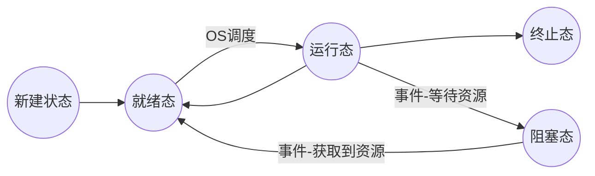

## 进程与线程
### CPU管理的直观想法
* 操作系统为了管理CPU就得让CPU工作起来，操作系统开始执行程序。  
* 但当操作系统只执行一个程序，遇到费时的IO指令或者阻塞时，CPU的利用率将很低也就起不到管理好CPU的作用。 
* 为了提高CPU利用率，就应该让CPU时刻处于工作状态，CPU应该交替执行多个程序，并行。
* 并行执行时，实质为寄存器PC在程序间来回切换。运行的程序存在于内存，静态的程序存在于磁盘。
* 为了保存切出去时刻当前运行程序的运行信息，引入**PCB (Process Control Block 用来记录进程信息的数据结构)。** 
* 为了区分运行的程序和静态的程序，引入进程。

**进程：** 运行着的程序 = 资源 + 指令执行序列。
**结论：** 操作系统为了管理好CPU，就应该引入多进程。

### L9 多进程图像
**定义：** 启动的程序就是进程，多进程就是操作系统需要将这些多个进程记录好、并按合理的次序推进（分配资源、进行调度）

对于上层用户来说，是创建了多少个进程；对于下层的操作系统来说，是创建对应的PCB对进程进行合理的推进，多进程图像从启动开始到关机结束。

#### 多进程如何组织？
* 通过PCB来组织
* 操作系统利用多个进程的PCB以及状态形成不同的队列(执行、就绪队列、等待队列)将进程区分开来并推进。



#### 多进程如何切换？
**队列操作** + **调度** + **切换**
调度选择下一个进程，得到下个进程PCB,将进程中PCB的信息与CPU的信息进行交换

#### 多进程如何影响？
**原因：** 多进程都放内存中
**映射表**  对多进程地址空间的分离(内存管理)

#### 多进程如何合作？
**进程同步（合理的推进顺序）**


### L10 用户级线程
**进程 = 资源 + 指令序列** 
所以在进程切换时，需要将所对应的资源以及指令序列都进行切换。

指令序列的切换相对于资源的切换更加容易，那可不可以在同一块资源下，只执行指令序列的切换来进行工作呢？  => 线程
**线程：** 保留了并发的优点，避免了进程切换代价，实质就是映射表不变而PC指针变。

当多个线程的函数调用存在一个栈中，就算线程已经发生了切换，但当函数调用结束开始弹栈时仍然会出现执行原本线程下面的函数调用。**各线程需要具有不同的栈空间**，才能正确的切换执行。

**TCB**(Thread Control Block )：全局的数据结构，类似于进程中的PCB，记录线程切换时栈的地址等信息。

线程切换 = TCB + 栈

Thread_Yield  
两个线程的样子：两个TCB、两个栈、切换的PC在栈中。

Thread_Create：TCB、栈、TCB与栈关联、栈中存放返回地址
```C++
void Thread_Create(A)
{
    TCB* tcb = malloc();//申请内存作为TCB
    *stack = malloc();//申请内存作为栈
    *stack = A;//将函数初始地址存入栈
    tcb.esp = stack;//栈和TCB关联
    ...
}

void Thread_Yield ()//用户自定义切换程序
{
    压入现场；
    esp放入当前TCB中；
    调度函数；
    从下个TCB取出esp；
    弹栈切换线程；
}
```
**缺点：** 由于是用户态线程，当其中某一个线程试图去操作磁盘设备(磁盘等资源是由内核管理)进入内核，当在内核态阻塞时用户态的线程对于内核不可见；（1）当存在多进程时，因此操作系统会直接切换进程，原本线程所在的进程下的工作都会停止。（2）当只有一个进程时，该进程全被该线程阻塞，无响应。

### L11 内核级线程
ThreadCreate是系统调用，内核管理TCB和负责切换线程。

多处理器：每个CPU有自己独立的缓存和MMU(内存隐射)  
多核：每个CPU有共用缓存和MMU